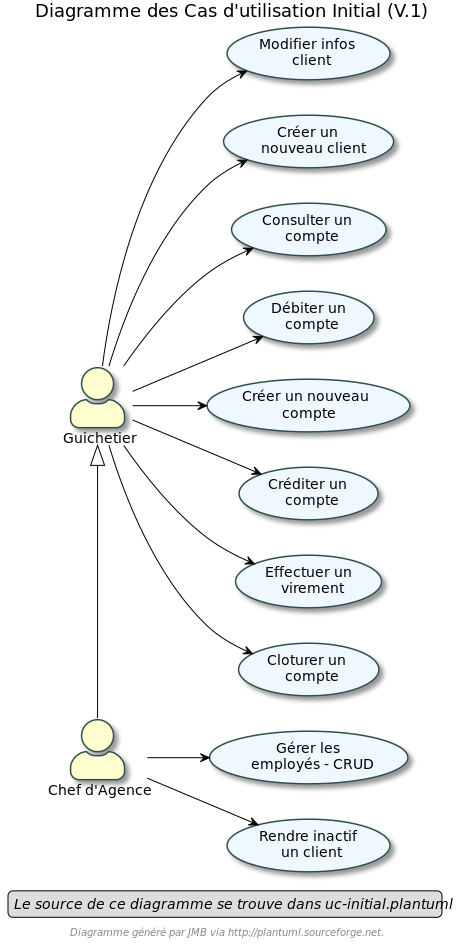

= Documentation technique de l'application DailyBank V1
:doctype: book
:toc: left
:toc-title: Table des matières
:sectnums:
Auteurs: Yannis Gibert, Julien Couderc, Enzo Fournet

Date: {docdate}

== Présentation de l'application

La banque DailyBank a l'intention de créer une application JAVA-Oracle destinée à gérer les comptes clients, afin de remplacer plusieurs outils devenus obsolètes. Ce projet s'inscrit dans le cadre de la restructuration des services bancaires de la banque et l'application sera déployée dans les 100 agences de son réseau.

=== Use Case Version 1

