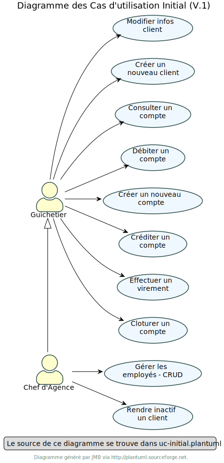
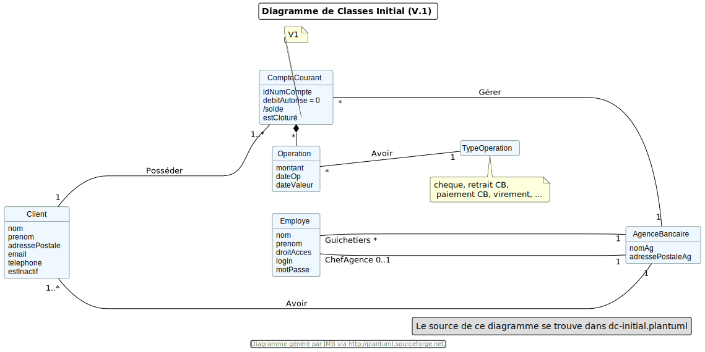
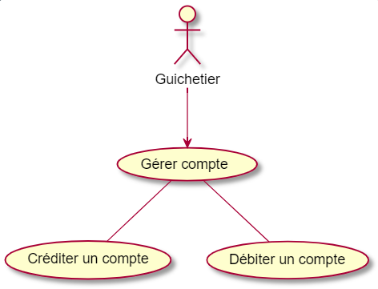

= Documentation technique de l'application DailyBank V1
:doctype: book
:toc: left
:toc-title: Table des matières
:sectnums:
Auteurs: Yannis Gibert, Julien Couderc, Enzo Fournet

Date: {docdate}

== Présentation de l'application

La banque DailyBank a l'intention de créer une application JAVA-Oracle destinée à gérer les comptes clients, afin de remplacer plusieurs outils devenus obsolètes. Ce projet s'inscrit dans le cadre de la restructuration des services bancaires de la banque et l'application sera déployée dans les 100 agences de son réseau.

=== Use Case Version 1

==== Présentation des utilisateurs et leurs actions

Dans la version actuelle du système, nous conservons les deux types d'utilisateurs existants : le chef d'agence et les guichetiers. Cependant, le chef d'agence bénéficie de privilèges et de droits supplémentaires au sein de son agence bancaire par rapport aux guichetiers.

En tant que chef d'agence, il est responsable de la gestion de son agence et dispose de droits étendus. Outre la possibilité de rendre inactif un client inscrit dans son agence, le chef d'agence peut également gérer les employés de l'agence. Cette fonctionnalité permet au chef d'agence de gérer efficacement l'équipe et d'attribuer des tâches spécifiques à chaque employé.

Il est important de noter que cette fonctionnalité n'est pas réciproque, car elle respecte la hiérarchie des rôles au sein de l'agence bancaire. Ainsi, les guichetiers ne peuvent pas gérer les autres employés, se limitant à leurs propres tâches et responsabilités.

Pour les guichetiers, en plus des fonctionnalités présentes dans la version précédente, telles que la modification des informations client, la création de nouveaux comptes et la consultation des comptes, des fonctionnalités supplémentaires sont ajoutées. Les guichetiers peuvent désormais créer de nouveaux comptes pour les clients, créditer les comptes des clients, effectuer des virements de compte à compte, ainsi que clôturer les comptes sélectionnés.

Ces nouvelles actions offrent aux guichetiers une plus grande autonomie et leur permettent d'effectuer des opérations courantes de gestion de compte de manière plus complète. Cependant, il est essentiel de prendre en compte les problématiques et les contraintes liées à ces utilisations afin de garantir la sécurité des transactions et la conformité aux règles bancaires en vigueur.

=== Diagramme de classe des données

== Architecture

=== Architecture générale

L'utilisation de l'application "DailyBank" par les employés est globalement simple et intuitive. Bien qu'elle ne respecte pas toutes les règles de conception d'une interface optimale, comme la règle des trois clics pour accéder rapidement aux informations, l'application reste claire et facile à comprendre.

Son architecture centralisée contribue également à sa facilité de compréhension. Les différents éléments et fonctionnalités sont organisés de manière logique, ce qui permet aux utilisateurs de naviguer efficacement dans l'application et d'accéder aux informations nécessaires.

image::RessourceAdoc/img/archi.png[Alt Architecture, 75%]

==== Poste client

L'application est conçue pour être utilisée par n'importe quel employé, indépendamment de son poste de travail au sein de l'agence bancaire. Cela signifie que toutes les modifications ou ajouts de données effectués depuis un poste de travail sont directement synchronisés avec la base de données de l'application.

Chaque poste de travail est dédié à un employé spécifique de l'agence bancaire. Ainsi, lorsque l'employé effectue des actions dans l'application, telles que la modification d'informations client ou l'exécution de transactions, ces changements sont immédiatement enregistrés dans la base de données centrale. Cela permet d'assurer que toutes les données sont mises à jour et cohérentes, quel que soit le poste de travail utilisé.

==== Serveurs

L'application dispose d'une base de données dédiée qui permet de stocker toutes les informations spécifiques à une agence bancaire. Cette base de données contient différentes catégories d'informations, notamment :

* Les employés : La base de données conserve les détails des employés de l'agence, tels que leurs noms, leurs identifiants, leurs rôles et leurs informations de contact. Cela permet de gérer et de suivre les informations relatives au personnel de l'agence.

* Les clients : Les informations des clients sont également enregistrées dans la base de données. Cela inclut les détails personnels des clients, tels que leurs noms, adresses, numéros de téléphone, ainsi que d'autres informations pertinentes. Ces données permettent de suivre les relations avec les clients et de fournir un service personnalisé.

* Les comptes des clients : La base de données stocke les informations sur les comptes bancaires des clients. Cela comprend les numéros de compte, les soldes, les types de comptes et les historiques des transactions. Ces données permettent de gérer les comptes clients, les mouvements d'argent et les opérations bancaires courantes.

* Les opérations effectuées depuis un compte : La base de données enregistre les différentes opérations effectuées à partir des comptes des clients, telles que les dépôts, les retraits, les virements et les paiements. Ces informations sont essentielles pour suivre les activités financières des clients et maintenir un registre précis des transactions.*

=== Ressources externes et rôles

Dans le cadre du projet, l'application "DailyBank" a été développée en utilisant le langage de programmation Java. Le fichier de l'application a une extension ".jar", qui offre des avantages pour stocker l'ensemble des définitions de classes et leurs métadonnées, constituant ainsi le programme dans son intégralité.

Pour utiliser cette application de gestion des comptes clients, les employés doivent s'assurer que leurs postes de travail disposent de la version 1.8 de Java Runtime Environment (JRE). La présence de la JRE 1.8 est essentielle pour exécuter correctement l'application.

Dans le contexte de "DailyBank", la bibliothèque utilisée est au format jar. De plus, l'application repose sur un fichier spécifique appelé "ojdbc6.jar", qui est un pilote JDBC d'Oracle. Ce pilote fournit une connectivité entre la base de données Oracle et l'interface de programmation d'application JDBC disponible en Java.

Ces ressources externes, telles que le fichier jar de l'application et le pilote JDBC, jouent un rôle crucial dans le bon fonctionnement de l'application "DailyBank". Ils permettent d'assurer la compatibilité, la connectivité et l'accès aux fonctionnalités nécessaires pour interagir avec la base de données et fournir une expérience utilisateur fluide et fiable.

=== Structuration de l'application

[source]
----
.── application
│   ├── application.control
│   ├── application.tools
│   └── application.view
└── model
    ├── model.data
    └── model.orm
        └── model.orm.exception
----

=== Elements

Le code de l’application est fourni dans 1 package principal étant application et dont celui-ci est constitué de 4 sous-packages principaux :

____
* control
* tools
* view
* model
____

Ces packages suivent le principe de structuration couramment utilisé dans les applications web, appelé Modèle-Vue-Contrôleur (MVC).

Le Modèle-Vue-Contrôleur est une méthodologie ou un motif de conception qui permet de lier l'interface utilisateur avec les modèles de données sous-jacents. Cela est particulièrement utile dans le développement d'applications web, car il facilite la structuration du projet en trois parties distinctes : le modèle, la vue et le contrôleur.

Le modèle représente les données et la logique métier de l'application. Il s'agit de la couche qui interagit avec la base de données et gère les opérations de manipulation des données.

La vue est responsable de l'interface utilisateur et de l'affichage des données. Elle présente les informations au format approprié pour les utilisateurs et permet leur interaction avec l'application.

Le contrôleur agit en tant qu'intermédiaire entre le modèle et la vue. Il reçoit les actions et les requêtes de l'utilisateur, traite ces informations, effectue les opérations nécessaires sur le modèle et met à jour la vue en conséquence.

En utilisant le modèle MVC, on peut mieux organiser le code de l'application, faciliter la maintenance et permettre la réutilisation des composants. Cela se traduit par une réduction du temps de développement et une meilleure gestion de l'interface utilisateur dans le cadre d'un projet technique.

=== Spécificités

Le package "application" est le package principal de l'application "DailyBank". Comme expliqué précédemment dans la section de structuration en packages de l'application, ce package contient trois sous-packages, dont les sous-packages "view" et "control" font partie du modèle MVC.

____
* Le sous-package "control" regroupe des classes qui facilitent la communication entre les classes du modèle et la vue. Ces classes sont responsables de l'affichage des différentes fenêtres ou sous-fenêtres de l'application "DailyBank".

* Le sous-package "tools", comme son nom l'indique, contient des classes qui fournissent des outils pour gérer certaines parties du code de l'application. Cela inclut la gestion des droits, des opérations et des pop-ups, entre autres.

* Le sous-package "view" regroupe un ensemble de classes qui représentent les différents éléments de l'interface utilisateur, tels que les boutons, les listes, etc. Il contient également les "controllers" des différentes fenêtres ou sous-fenêtres, associés à leurs fichiers FXML respectifs.
____

Le sous-package principal "model" correspond à la partie "modèle" de l'acronyme MVC. Ce package est responsable de la représentation de la structure des données dans l'application logicielle, et il contient également la classe principale associée. Contrairement aux deux autres packages, il ne contient aucune information liée à l'interface utilisateur. Voici une description détaillée de chaque sous-package :

____
* Le sous-package "data" contient des classes qui représentent l'environnement d'une application de gestion de comptes clients, tels que l'agence bancaire, ses employés, les clients, leurs comptes et les différentes opérations disponibles. Ces classes définissent la structure des données et fournissent des méthodes pour interagir avec elles.

* Le sous-package "orm" regroupe des classes qui permettent de lier le code Java à la base de données utilisée par l'application. Ces classes facilitent l'accès et la manipulation des informations stockées dans la base de données. Elles sont responsables de l'initialisation des données nécessaires à l'application, ainsi que de la création, de la mise à jour et de la récupération des informations.

* Le sous-package "orm.exception" contient des classes qui gèrent les erreurs ou les exceptions pouvant se produire dans l'application. Ces classes fournissent des mécanismes de gestion des erreurs, de notification et de traitement appropriés lorsqu'une exception survient lors de l'accès ou de la manipulation des données.
____

=== Prérequis pour le développement

Pour les personnes chargées de maintenir l'application, effectuer des tests de fonctionnement ou mettre en œuvre de nouvelles fonctionnalités, plusieurs éléments sont nécessaires.

Tout d'abord, il est impératif d'avoir une version 1.8 de la machine virtuelle Java (JRE) installée. Cela garantit la compatibilité avec l'application.

Ensuite, il est recommandé d'utiliser un environnement de développement intégré (IDE) tel que Eclipse ou IntelliJ IDEA. Ces IDE offrent des fonctionnalités avancées pour observer et interagir avec le code source de l'application.

Il est également important de disposer d'un Workspace configuré en JavaFX avec une version du JDK en 1.8. Cela permet d'assurer la compatibilité avec les fonctionnalités spécifiques à JavaFX. De plus, l'intégration du logiciel SceneBuilder dans le buildpath est recommandée pour faciliter l'interaction avec les fichiers FXML de l'application "DailyBank".

== Présentation de l'application
=== Guichetier

==== Modifier les informations d'un client - Déja présent (v0)

Un chef d’agence ou un guichetier peut modifier les informations d’un client selon les actualités tournant autour de celui-ci. Ces informations peuvent concerner le nom ou le prénom du client, son adresse, ses moyens de communication ou encore son évolutivité dans son agence bancaire, c’est-à-dire son activité.

Use case : 

image::RessourceAdoc/img/modifinfoclient.png[Alt modif client, 50%]

Partie du diagramme de classe : 

Cette tâche n’inclut seulement qu’une classe dans le diagramme de classes V1 : la classe Client. Cette classe est, de ce fait, dédiée à la modification des informations d’un client et par conséquent, à la mise à jour des données sur la base de données.

===== Principales fonctionnalités

Les principales fonctionnalités ont été introduites de manière brève dans l’introduction de cette opération. Pour plus de détails, veuillez vous référer à la documentation utilisateur.

===== Classes impliquées à l'implémentation de la fonction

Côté application.tools :

* CategorieOperation.java

* ConstantesIHM.java

Côté application.control :

* ClientEditorPane.java

* ClientManagement.java

* ExceptionDialog.java

Côté application.view :

* ClientEditorPaneController.java

* ClientManagementController.java

Côté model.data :

* Client.java

Côté model.orm / model.orm.exception :

* AccessClient.java

* ApplicationException.java

* DatabaseConnexionException.java

* DataAccessException.java

===== Eléments à connaître / spécificités

L’élément à connaître pour cette tâche est une fonction et celle-ci réside dans la classe ClientsManagement.java : modifierClient(Client c).

==== Créer un nouveau client - Déja présent (V0)

Un chef d’agence ou un guichetier peut créer/ insérer les informations d’un client. Ces informations peuvent concerner le nom ou le prénom du client, son adresse, ses moyens de communication (mail ou téléphone) ou encore son évolutivité dans son agence bancaire, c’est-à-dire son activité, s’il est actif ou non.

Use case : 

Partie du diagramme de classe : 

Cette tâche n’inclut seulement qu’une classe dans le diagramme de classes V1 : la classe Client. Cette classe est, de ce fait, dédiée à la création/insertion des informations d’un client et par conséquent, à l’insertion des données sur la base de données.

===== Principales fonctionnalités 

Les principales fonctionnalités ont été introduites de manière brève dans l’introduction de cette opération. Pour plus de détails, veuillez vous référer à la documentation utilisateur.

===== Classes impliquées de cette action, plusieurs classes ont été impliquées:

Côté application.tools :

* CategorieOperation.java

* ConstantesIHM.java

Côté application.control :

* ClientEditorPane.java

* ClientManagement.java

* ExceptionDialog.java

Côté application.view :

* ClientEditorPaneController.java

* ClientManagementController.java

Côté model.data :

* Client.java

===== Eléments à connaître / spécificités

L’élément à connaître pour cette tâche est une fonction et celle-ci réside dans la classe ClientsManagement.java : nouveauClient().

==== Effectuer un débit - Déja présent (V0)

Débiter un compte permet de retirer une somme d’argent depuis un compte bancaire sélectionné associé à un client. Il est impossible d'effectuer un débit d'un montant négatif ou nul. De plus, le nouveau solde du compte lors d'un débit ne doit pas dépasser le découvert maximum autorisé.

===== Partie du use case

===== Partie du diagramme de classe

Dans ce diagramme de classes, la tâche "Débit" est représentée par trois classes distinctes :

* La classe "CompteCourant" est utilisée uniquement pour la lecture des informations d'un compte. Elle ne modifie pas les données du compte, mais permet d'accéder aux informations le concernant.

* La classe "TypeOperation" est également dédiée à la lecture seule. Elle caractérise le type d'opération, sans interagir avec les données elles-mêmes.

* En revanche, la classe "Operation" utilise les données fournies par l'utilisateur. Elle ne se limite pas à la lecture, mais interprète ces données pour effectuer l'opération de débit. Elle est responsable de la manipulation et de la mise à jour des informations relatives à cette opération.

===== Principales fonctionnalités

Une brève introduction des principales fonctionnalités de cette opération a été présentée précédemment. Pour obtenir des informations plus détaillées, veuillez consulter la documentation utilisateur. Elle fournira des explications approfondies sur les différentes fonctionnalités et leur utilisation dans le cadre de cette opération spécifique.

===== Classes associées à l'implémentation de la fonctionnalité

Pour l’implémentation de cette action, plusieurs classes ont été impliquées :

*Côté ``application.tools`` :* +
____

• CategorieOperation.java

• ConstantesIHM.java
____

*Côté ``application.control`` :* +
____
• _CompteManagement.java_
• _CompteEditorPane.java_
• _ExceptionDialog.java_
____

*Côté ``application.view`` :* +
____
• _CompteManagementController.java_
____

*Côté ``model.data`` :* +
____
• _Compte.java_
____

*Côté ``model.orm / model.orm.exception`` :* +
____
• _AccessCompteCourant.java_
• _ApplicationException.java_
• _DatabaseConnexionException.java_
• _DataAccessException.java_
____

===== Extrait d'un code

image::RessourceAdoc/img/CodeDébiter.png[Alt code debiter, 50%]

Ce code est essentiel pour enregistrer les débits dans la base de données SQL, en fonction de la procédure "Débiter". Il gère également les types d'opérations et les montants à débiter.

==== Créer un nouveau compte - Yannis Gibert

Le chef d'agence ou le guichetier a la possibilité de créer un compte courant pour un client et de saisir les informations correspondantes, telles que le débit autorisé et le premier dépôt du compte.

===== Partie du use case : 

image::RessourceAdoc/img/creercompte.png[Alt creer compte, 50%]

===== Partie du diagramme de classe : 

image::RessourceAdoc/img/dcCompteCourant.png[Alt dc compte, 50%]

La tâche concerne exclusivement la classe Client de la version 1 du diagramme de classes. Cette classe est spécifiquement conçue pour la modification des informations d'un client et de ses comptes, ce qui implique la mise à jour des données dans la base de données.

===== Classes impliquées à l'implémentation de la fonction

Voici toutes les classes impliquées pour cette action :

Côté application.tools :

* CategorieOperation.java

*EditionMode.java

Côté application.control :

* CompteManagement.java

* CompteEditorPane.java

* ExceptionDialog.java

Côté application.view :

* CompteManagementController.java

Côté model.data :

* Compte.java

Côté model.orm / model.orm.exception :

* Access_BD_CompteCourant.java

* ApplicationException.java

* DatabaseConnexionException.java

* DataAccessException.java

===== Eléments à connaître / spécificités

Ici, lorsque nous ajoutons un compte à la base de données, si l’on renseigne un découvert autorisé positif, celui-ci deviendra négatif lors de l’ajout, nous adoptons la méthode updateCompte implémenté de la classe Access_BD_CompteCourant

image::RessourceAdoc/img/expliUpdateCompte.png[Alt update compte, 75%]

===== Commentaire

Toutes les méthodes ajoutées sont commentées afin de permettre une meilleure compréhension.

==== Clôturer un compte - Yannis Gibert

===== Partie du use case :

image::RessourceAdoc/img/cloturerCompte.png[Alt cloturer compte, 50%]

===== Partie du diagramme de classe : 

image::RessourceAdoc/img/dcCompteCourant.png[Alt dc compte, 50%]

===== Principales fonctionnalités : 

Les principales fonctionnalités ont été succinctement présentées dans l'introduction de cette opération. Pour obtenir des informations plus détaillées, veuillez consulter la documentation utilisateur.

===== Classes impliquées à l'implémentation de la fonction

Pour l'implémentation de cette action, plusieurs classes ont été impliquées

Côté application.tools :

* CategorieOperation.java

* EditionMode.java

Côté application.control :

* CompteManagement.java

* ExceptionDialog.java

Côté application.view :

* CompteManagementController.java

Côté model.data :

* Compte.java

Côté model.orm / model.orm.exception :

* Access_BD_CompteCourant.java

* ApplicationException.java

* DatabaseConnexionException.java

* DataAccessException.java

===== Eléments à connaître / spécificités 

Afin de pouvoir cloturer le compte le solde de ce dernier doit être égal à 0.

===== Commentaire

Toutes les méthodes ajoutées sont commentées afin de permettre une meilleure compréhension.

==== Modifier un compte - Yannis Gibert

Un chef d'agence ou un guichetier peut modifier les informations d'un compte client. La seule information modifiable est le découvert autorisé.

===== Partie du use case : 

===== Partie du diagramme de classe : 

image::RessourceAdoc/img/dcCompteCourant.png[Alt dc compte courant, 50%]

Cette tâche inclut qu'une classe dans le diagramme de classes V1

==== Effectuer un crédit - Julien Couderc

Créditer un compte permet d'ajouter une somme d’argent depuis un compte bancaire sélectionné associé à un client. Il est impossible d'effectuer un crédit d'un montant négatif ou nul. De plus, le crédit ne doit pas dépasser 1 milion d'euros.

===== Partie du use case

===== Partie du diagramme de classe

Dans ce diagramme de classes, la tâche "Crédit" est représentée par trois classes distinctes :

* La classe "CompteCourant" est utilisée uniquement pour la lecture des informations d'un compte. Elle ne modifie pas les données du compte, mais permet d'accéder aux informations le concernant.

* La classe "TypeOperation" est également dédiée à la lecture seule. Elle caractérise le type d'opération, sans interagir avec les données elles-mêmes.

* En revanche, la classe "Operation" utilise les données fournies par l'utilisateur. Elle ne se limite pas à la lecture, mais interprète ces données pour effectuer l'opération de débit. Elle est responsable de la manipulation et de la mise à jour des informations relatives à cette opération.

===== Principales fonctionnalités

Une brève introduction des principales fonctionnalités de cette opération a été présentée précédemment. Pour obtenir des informations plus détaillées, veuillez consulter la documentation utilisateur. Elle fournira des explications approfondies sur les différentes fonctionnalités et leur utilisation dans le cadre de cette opération spécifique.

===== Classes associées à l'implémentation de la fonctionnalité

Pour l’implémentation de cette action, plusieurs classes ont été impliquées :

*Côté ``application.tools`` :* +
____
• _CategorieOperation.java_
• _ConstantesIHM.java_
____

*Côté ``application.control`` :* +
____
• _OperationManagement.java_
• _OperationEditorPane.java_
____

*Côté ``application.view`` :* +
____
• _OperationManagementController.java_
• _OperationEditorPaneController.java_
____

*Côté ``model.data`` :* +
____
• _Operation.java_
• _TypeOperation.java_
____

*Côté ``model.orm / model.orm.exception`` :* +
____
• _AccessOperation.java_
• _DatabaseConnexionException.java_
• _DataAccessException.java_
____

===== Extrait d'un code

image::RessourceAdoc/img/CodeCréditer.png[Alt code crediter, 75%]

Ce code est essentiel pour enregistrer les crédits dans la base de données SQL, en fonction de la procédure "Créditer". Il gère également les types d'opérations et les montants à créditer.

==== Effectuer un virement - Julien Couderc

Effectuer un virement permet de faire un crédit d'un compte et faire un débit à un autre compte. Pour effectuer cela, il faut que le montant sélectionné ne soit pas négatif ou égal à 0. De plus, il ne doit pas dépasser les 1 million d'euros mais aussi, il faut que le solde du compte qui effectue le virement ne dépasse pas le découvert maximum autorisé.

===== Partie du use case

===== Partie du diagramme de classe

Dans ce diagramme de classes, la tâche "Crédit" est représentée par trois classes distinctes :

* La classe "CompteCourant" est utilisée uniquement pour la lecture des informations d'un compte. Elle ne modifie pas les données du compte, mais permet d'accéder aux informations le concernant.

* La classe "TypeOperation" est également dédiée à la lecture seule. Elle caractérise le type d'opération, sans interagir avec les données elles-mêmes.

* En revanche, la classe "Operation" utilise les données fournies par l'utilisateur. Elle ne se limite pas à la lecture, mais interprète ces données pour effectuer l'opération de débit. Elle est responsable de la manipulation et de la mise à jour des informations relatives à cette opération.

===== Principales fonctionnalités

Une brève introduction des principales fonctionnalités de cette opération a été présentée précédemment. Pour obtenir des informations plus détaillées, veuillez consulter la documentation utilisateur. Elle fournira des explications approfondies sur les différentes fonctionnalités et leur utilisation dans le cadre de cette opération spécifique.

===== Classes associées à l'implémentation de la fonctionnalité

Pour l’implémentation de cette action, plusieurs classes ont été impliquées :

*Côté ``application.tools`` :* +
____
• _CategorieOperation.java_
• _ConstantesIHM.java_
____

*Côté ``application.control`` :* +
____
• _OperationManagement.java_
• _OperationEditorPane.java_
____

*Côté ``application.view`` :* +
____
• _OperationManagementController.java_
• _OperationEditorPaneController.java_
____

*Côté ``model.data`` :* +
____
• _Operation.java_
• _TypeOperation.java_
____

*Côté ``model.orm / model.orm.exception`` :* +
____
• _AccessOperation.java_
• _DatabaseConnexionException.java_
• _DataAccessException.java_
____

===== Extrait d'un code

image::RessourceAdoc/img/CodeCréditer.png[Alt code crediter, 75%]

Ce code est essentiel pour enregistrer les crédits dans la base de données SQL, en fonction de la procédure "Créditer". Il gère également les types d'opérations et les montants à créditer.

====  CRUD employés - Enzo Fournet

Le CRUD permet de créer, lire, mettre à jour et supprimer des employés. Il est possible de créer un employé, de le lire, de le modifier et de le supprimer. Il est également possible de lire tous les employés enregistrés dans la base de données.