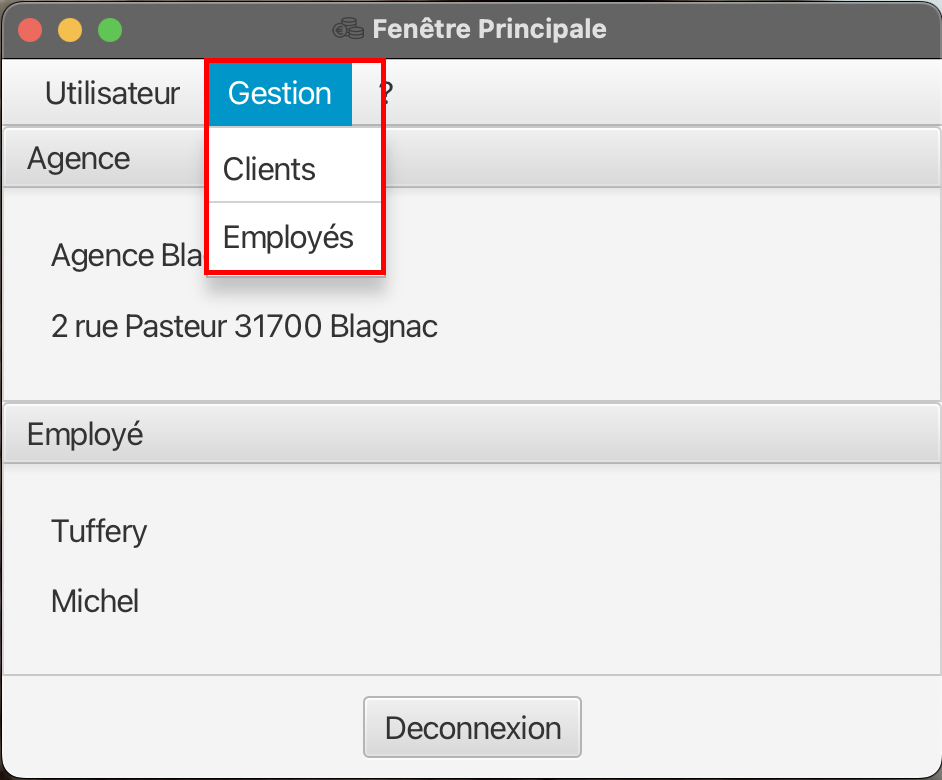

= Documentation utilsateur de l'application DailyBank V1
:doctype: book
:toc: left
:toc-title: Table des matières
:sectnums:
Auteurs: Yannis Gibert, Julien Couderc, Enzo Fournet

Date: {docdate}

== Introduction

Cette documentation est destinée à guider les utilisateurs de l'application DailyBank dans son utilisation seulement.

== Prérequis

Vos identifiants de connexion à l'application.

Un ordinateur capable d'executer un fichier .jar, compiler sous java 17.

== Utilisation de l'application

Pour lancer l'application il vous suffit donc de vous munir d'un ordinateur capable d'executer un fichier .jar et de lancer le fichier DailyBank.jar. Puis de vous connecter avec vos identifiants.

Page de connexion :

[horizontal]
image::RessourcesAdoc/img/PageConnexion.png[Alt Page de connexion, 50%]

=== Connecté en tant que chef d'agence
Comme vous pouvez le contaster sur l'image ci-dessous, une fois connecté en tant que chef d'agence vous avez accès à un menu déroulant "Gestion" tout comme le guichetier qui vous permet d'accéder à la gestion des clients et des employés de votre agence.

=== Connecté en tant que guichetier
Comme vous pouvez le contaster sur l'image ci-dessous, une fois connecté en tant que guichetier vous avez accès à un menu déroulant "Gestion" tout comme le chef d'agence qui vous permet d'accéder à la gestion des clients seulement.

image::RessourcesAdoc/img/co-guich.png[Alt Page de connexion d'un guichetier, 50%]

== Utilisation de l'application
=== Enzo Fournet :

==== Gestion des employés :
*Prérequis : Être connecté en tant que chef d'agence.*

Une fois connecter en tant que chef s'agence vous pouvez 
accéder à la gestion des employés en cliquant sur le bouton "Gestion" puis en cliquant sur "Employés".

image::RessourcesAdoc/img/chefGestEmpl.png[Alt Page de connexion clique pour accéder à la gestion des employés, 50%]

Une fois que vous avez accédé à la gestion des emplyés.

image::RessourcesAdoc/img/GestEmpl.png[Alt page de gestion des emplyés, 70%]

Vous pouvez voir la liste des employés de votre agence,vous avez alors la possibilité de double cliqué sur un employé pour le modifier ou le consulter en fcontion de vos droits.
Vous avez aussi la possibilité de fare un clique droit sur un employé pour faire apparaitre un menu contextuel qui vous permettra de modifier, de consulter ou de supprimer un employé en fonction de vos droits.

Les boutons lattéraux sont aussi utilisable pour modifier ou consulter un employé et seront dégrissé si vousavez pas les droits pour faire l'action demandé.

==== Consultation d'un employé :
*Prérequis : Être connecté en tant que chef d'agence et s'être rendu dans la gestion des emplyés*

Une fois que vous avez accédé à la gestion des employés.
Vous avez le droit de consulter n'importe quel employé de votre agence en double cliquant sur un employé ou en faisant un clique droit puis en cliquant sur "Consulter" ou encore en utilisant le boutons latéral.

*ATTENTION* : Si vous double cliquer sur un emploté pour lequel vous avez les droit de modification vous serez redirigé vers la page de modification de l'employé et non de consultation.

image::RessourcesAdoc/img/BoutonLat-Consult.png[Alt Bouton lattéral de consultation, 70%]

image::RessourcesAdoc/img/Bouton2Click-Consult.png[Alt Page de consultation d'un employé, 70%]

Lorsque vous aurez accédé à la page de consultation d'un employé vous aurez accès à toutes les informations de l'employé.

Pour revenir à la page de gestion des employés il vous suffit de cliquer sur le bouton "Ok" en bas à droite de la page.

==== Création d'un nouvel employé :

*Prérequis : Être connecté en tant que chef d'agence et s'être rendu dans la gestion des emplyés*

Une fois que vous avez accédé à la gestion des employés.
Vous avez le droit de créer un nouvel employé en cliquant sur le bouton "Nouvel employé" en bas à gauche de la page.
Vous devrez alors remplir tout les champs disponnible du formulaire de création d'un employé .

==== Modification d'un employé :

*Prérequis : Être connecté en tant que chef d'agence et s'être rendu dans la gestion des emplyés*

Une fois que vous avez accédé à la gestion des employés.
Vous avez le droit de modifier tout les guichetier de votre agence et vous même en double cliquant sur un employé que vous pouvez modifir ou en faisant un clique droit puis en cliquant sur "Modifier" ou encore en utilisant le boutons latéral lorsque vous avez les droits nécessaire.

*ATTENTION* : Si vous double cliquer sur un emploté pour lequel vous n'avez les droit de modification vous serez redirigé vers la page de consulation de l'employé et non de modification.

image::RessourcesAdoc/img/BoutonLat-Modif.png[Alt Bouton lattéral de modification, 70%]

Loresque vous aurez accédé à la page de modification d'un employé vous aurez accès à toutes les informations de l'employé et vous pourrez modifier celle qui seront accéssible.

Pour Valider les modifications il vous suffit de cliquer sur le bouton "Modifier" en bas à droite de la page et pour annuler les modifications il vous suffit de cliquer sur le bouton "Annuler" en bas à droite de la page.

image::RessourcesAdoc/img/ModifEmpl-btn.png[Alt Page de modification d'un employé, 70%]

==== Suppression d'un employé :
*Prérequis : Être connecté en tant que chef d'agence et s'être rendu dans la gestion des emplyés*

Une fois que vous avez accédé à la gestion des employés.
Vous avez seulement le droit de supprimer des guichetier de votre agence en faisant un clique droit puis en cliquant sur "Supprimer" ou encore en utilisant le boutons latéral lorsque vous avez les droits nécessaire.

Loresque vous aurez accédé à la page de suppression d'un employé vous aurez accès à toutes les informations de l'employé et vous pourrez supprimer l'employé.

image::RessourcesAdoc/img/SupprEmpl.png[Alt Page de suppression d'un employé, 70%]

Pour Valider la suppression il vous suffit de cliquer sur le bouton "Supprimer" en bas à droite de la page et pour annuler la suppression il vous suffit de cliquer sur le bouton "Annuler" en bas à droite de la page.

=== Yannis Gibert :

==== Création d'un compte :

*Prérequis : Être connecté en tant que guichetier et s'être rendu dans la gestion des clients*

Une fois que vous avez accédé à la gestion des clients.
Vous pourez créer un nouveau compte en cliquant sur le bouton "Ajouter" en bas à droite de la page. Ou annuler en cliquant sur le bouton "Annuler" en bas à droite de la page.

[horizontal]
Une fois sur la page d'acceuil il vous suffit de passer la souris sur le bouton "Gestion" ce qui ouvre un menu déroulant permettant de sélectionner entre Clients et Employés. Ici ce que nous intéressera est la partie Clients, il suffit donc de cliquer dessus afin d'accéder au menu des clients.

image::RessourcesAdoc/img/MenuGestion.png[Alt Page de connexion, 50%]

Une fois sur la page des clients vous pouvez voir la liste de tout les clients étant dans la même agence que le guichetier. Vous pouvez en cliquant sur un client activer le bouton "Comptes client", en cliquant sur ce dernier vous serez redirigé vers la page de gestion des comptes du client sélectionné.

image::RessourcesAdoc/img/MenuClient.png[Alt Page de connexion, 50%]

Une fois sur la page des comptes du client il vous suffit de cliquer sur "Nouveau Compte" ce qui lancera la page de création d'un nouveau compte.

image::RessourcesAdoc/img/MenuCompte.png[Alt Page de connexion, 50%]

Vous voici sur la page de création du compte, les informations "Id client", "Id agence" et "Numéro compte" sont remplis automatiquement et non modifiable, en dessous vous trouverez la case "Découvert autorisé" que vous pouvez modifiez afin de saisir le découvert que vous souhaitez accorder à ce compte. Dernièrement vous trouverez la case "Solde (premier dépot)" que vous pouvez également modifier afin d'effectuer un premier dépot sur le compte du montant saisie. Une fois toutes les informations saisie vous pouvez alors cliquez sur le bouton "Ajouter" afin de valider la création du compte ou alors cliquer sur "Annuler" afin d'annuler la création du compte.

image::RessourcesAdoc/img/CréationCompte.png[Alt Page de connexion, 50%]

==== Cloturation d'un compte :

Une fois sur la page d'acceuil il vous suffit de passer la souris sur le bouton "Gestion" ce qui ouvre un menu déroulant permettant de sélectionner entre Clients et Employés. Ici ce que nous intéressera est la partie Clients, il suffit donc de cliquer dessus afin d'accéder au menu des clients.

image::RessourcesAdoc/img/MenuGestion.png[Alt Page de connexion, 50%]

Une fois sur la page des clients vous pouvez voir la liste de tout les clients étant dans la même agence que le guichetier. Vous pouvez en cliquant sur un client activer le bouton "Comptes client", en cliquant sur ce dernier vous serez redirigé vers la page de gestion des comptes du client sélectionné.

image::RessourcesAdoc/img/MenuClient.png[Alt Page de connexion, 50%]

Une fois sur la page des comptes du client il vous suffit de cliquer sur un compte afin de le sélectionner. Si le compte n'est pas cloturé alors le bouton "Cloturer" sera disponible, vous pouvez savoir si un compte est cloturé ou non en regardant la liste, si il est indiqué "Ouvert" cela signifie que le compte n'est pas cloturé et sinon si il est indiqué "Cloture" alors cela signifie que le compte est cloturé. En cliquant dessus la fenêtre de cloturation du compte s'ouvre.

image::RessourcesAdoc/img/MenuCompte2.png[Alt Page de connexion, 50%]

Vous voici sur la page de cloturation du compte, vous ne pouvez modifier aucune information sur cette page mais seulement les consulter afin de s'assurer qu'il s'agit bien du bon compte. Vous trouverez en bas un bouton "Supprimer", en cliquant dessus si le solde du compte est inférieur ou égal à 0 alors la page se ferme et le compte sera alors cloturé.

Néanmoins si le solde du compte n'est pas égal à 0 alors un message d'erreur s'affichera et empêchera la cloturation du compte, en cliquant sur "OK" vous retournez sur la page de gestion des comptes du client.

image::RessourcesAdoc/img/ErreurCloturation.png[Alt Page de connexion, 50%]

==== Modification d'un compte :

Une fois sur la page d'acceuil il vous suffit de passer la souris sur le bouton "Gestion" ce qui ouvre un menu déroulant permettant de sélectionner entre Clients et Employés. Ici ce que nous intéressera est la partie Clients, il suffit donc de cliquer dessus afin d'accéder au menu des clients.

image::RessourcesAdoc/img/MenuGestion.png[Alt Page de connexion, 50%]

Une fois sur la page des clients vous pouvez voir la liste de tout les clients étant dans la même agence que le guichetier. Vous pouvez en cliquant sur un client activer le bouton "Comptes client", en cliquant sur ce dernier vous serez redirigé vers la page de gestion des comptes du client sélectionné.

image::RessourcesAdoc/img/MenuClient.png[Alt Page de connexion, 50%]

Une fois sur la page des comptes du client il vous suffit de cliquer sur un compte afin de le sélectionner. Si le compte n'est pas cloturé alors le bouton "Modifier" sera disponible, vous pouvez savoir si un compte est cloturé ou non en regardant la liste, si il est indiqué "Ouvert" cela signifie que le compte n'est pas cloturé et sinon si il est indiqué "Cloture" alors cela signifie que le compte est cloturé. En cliquant dessus la fenêtre de modification du compte s'ouvre.

image::RessourcesAdoc/img/MenuCompte3.png[Alt Page de connexion, 50%]

Vous voici sur la page de modification du compte, vous ne pouvez y modifier qu'une seule information qui est le Découvert Autorisé. Une fois les modifications effectuées il vous suffit de cliquer sur "Modifier" afin de valider la modification du compte

image::RessourcesAdoc/img/ModifierCompte.png[Alt Page de connexion, 50%]

=== Julien Couderc :

=== Débit d'un compte :

Pour effectuer un débit, il vous suffit de vous connecter, puis passer la souris sur le bouton "Gestion" ce qui ouvre un menu déroulant permettant de sélectionner entre Clients et Employés. Ici ce que nous intéressera est la partie Clients, il suffit donc de cliquer dessus afin d'accéder au menu des clients.

image::RessourcesAdoc/img/MenuGestion.png[Alt Page de connexion, 50%]

Une fois sur la page des clients vous pouvez voir la liste de tout les clients étant dans la même agence que le guichetier. Vous pouvez en cliquant sur un client activer le bouton "Comptes client", en cliquant sur ce dernier vous serez redirigé vers la page de gestion des comptes du client sélectionné.

image::RessourcesAdoc/img/MenuClient.png[Alt Page de connexion, 50%]

Sur cette nouvelle page, vous devez cliquer sur un compte ouvert, puis cliquer sur voir opérations de ce compte.

image::RessourcesAdoc/img/voirOperations.png[Alt Page de connexion, 50%]

A partir de là, vous pouvez choisir l'opération que vous voulez, en ce qui nous concerne actuellement, nous allons faire un débit.

=== Crédit d'un compte :

=== Virement d'un compte à un autre :

== Nous contacter

Si vous avez des questions ou si vous avez besoin d'aide, n'hésitez pas à nous contacter à l'adresse suivante: support@DailyBank.com
