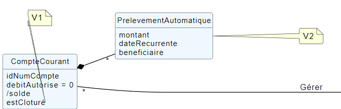

= Documentation technique de l'application DailyBank V2
:doctype: book
:toc: center
:toclevels: 3
:toc-title: Table des matières
:sectnums:
Auteurs: Yannis Gibert, Julien Couderc, Enzo Fournet

Date: {docdate}

== Présentation de l'application

La banque DailyBank a l'intention de créer une application JAVA-Oracle destinée à gérer les comptes clients, afin de remplacer plusieurs outils devenus obsolètes. Ce projet s'inscrit dans le cadre de la restructuration des services bancaires de la banque et l'application sera déployée dans les 100 agences de son réseau.

=== Prérequis pour l'instalation et l'utilisaton de l'application

Pour utiliser et installer l'application, il faut disposer d'un ordinateur pouvant executer Java 17. Il faut également disposer une base de données à laquelle l'applicaton pourra se connecter afin de stocker les données, de les récupérer et de les modifier tout au long de son utilisaton.

Attention, nous utilisons la verison 20 de javaFX sur notre porjer car les version antérieur ne sont pas compatible avec MAC M1.

Les commandes à retenir pour executer le projet avec maven sont :

- Pour clean le projet : 
```bash
mvn clean
```
- Pour compiler le projet : 
```bash
mvn clean compile
```
- Pour executer le projet : 
```bash
mvn clean javafx:run
```
- Pour compiler le projet et créer un ``.jar`` : 
```bash
mvn clean install
```
- Pour compiler le projet et créer un ``.jar`` en n'effectuant pas les tests :  
```bash
mvn clean install -DskipTests
```
- Pour compiler le projet et créer un ``.jar`` multiplateforme : 
```bash
mvn clean install -Dmaven.install=true
```
- Pour compiler le projet et créer un ``.jar`` multiplateforme en n'effectuant pas les tests : 
```bash
mvn clean install -Dmaven.install=true -DskipTests
```

=== Use Case Version 1

image::RessourceAdoc/img/uc-initialv1.svg[Alt UC V1, 50%]


==== Présentation des utilisateurs et leurs actions

Dans la version actuelle du système, nous conservons les deux types d'utilisateurs existants : le chef d'agence et les guichetiers. Cependant, le chef d'agence bénéficie de privilèges et de droits supplémentaires au sein de son agence bancaire par rapport aux guichetiers.

En tant que chef d'agence, il est responsable de la gestion de son agence et dispose de droits étendus. Outre la possibilité de rendre inactif un client inscrit dans son agence, le chef d'agence peut également gérer les employés de l'agence. Cette fonctionnalité permet au chef d'agence de gérer efficacement l'équipe et d'attribuer des tâches spécifiques à chaque employé.

Il est important de noter que cette fonctionnalité n'est pas réciproque, car elle respecte la hiérarchie des rôles au sein de l'agence bancaire. Ainsi, les guichetiers ne peuvent pas gérer les autres employés, se limitant à leurs propres tâches et responsabilités.

Pour les guichetiers, en plus des fonctionnalités présentes dans la version précédente, telles que la modification des informations client, la création de nouveaux comptes et la consultation des comptes, des fonctionnalités supplémentaires sont ajoutées. Les guichetiers peuvent désormais créer de nouveaux comptes pour les clients, créditer les comptes des clients, effectuer des virements de compte à compte, ainsi que clôturer les comptes sélectionnés.

Ces nouvelles actions offrent aux guichetiers une plus grande autonomie et leur permettent d'effectuer des opérations courantes de gestion de compte de manière plus complète. Cependant, il est essentiel de prendre en compte les problématiques et les contraintes liées à ces utilisations afin de garantir la sécurité des transactions et la conformité aux règles bancaires en vigueur.

=== Diagramme de classe des données

Le diagramme de classes suivant représente la base de données pour notre systèm de gestion bnacaire DayliBank. 
Si dessous voila une explication des différentes classes et de leurs relations.

- Employe: Cette classe représente un employé de la banque. Elle a des attributs tels que nom, prenom, droitAcces, login et motPasse. On peut voir qu'il y a deux types d'employés définis par leurs relations avec la classe AgenceBancaire : ChefAgence (0..1) et Guichetiers (*). Cela signifie qu'une agence bancaire peut avoir un ou pas de chef d'agence et un nombre quelconque de guichetiers.

- AgenceBancaire: Cette classe représente une agence bancaire avec des attributs tels que nomAg et adressePostaleAg. Elle est liée aux classes Employe, Client et CompteCourant montrant les différentes interactions possibles dans l'agence
.
- Client: Cette classe représente un client de la banque. Un client peut avoir plusieurs comptes (CompteCourant) et est associé à une AgenceBancaire. Un attribut particulier ici est estInactif, qui indique si le compte du client est inactif.
CompteCourant: Cette classe représente un compte courant d'un client dans la banque. Il a des attributs comme idNumCompte, debitAutorise et solde. Une version du diagramme inclut l'attribut estCloturé qui indique si le compte est fermé. Chaque CompteCourant peut avoir plusieurs Operation et est géré par une AgenceBancaire.

- Operation et TypeOperation: Ces classes représentent les différentes opérations qui peuvent être effectuées sur un compte. Chaque opération a un montant, une date d'opération, et une date de valeur. Chaque opération est également liée à un TypeOperation (par exemple, chèque, retrait CB, paiement CB, virement).

- En version 2, nous introduiront les classes PrelevementAutomatique, Emprunt et AssuranceEmprunt. PrelevementAutomatique est une opération spécifique liée à CompteCourant. Emprunt est une classe qui représente un emprunt qu'un client peut avoir, avec des détails comme le taux d'emprunt, le capital, la durée et la date de début. Un Emprunt peut être couvert par une AssuranceEmprunt.

Chaque classe représente une table dans la base de données, et chaque instance (ou objet) de la classe représente une ligne dans cette table. Les attributs de la classe sont les colonnes de la table. Les relations entre les classes (indiquées par les lignes dans le diagramme) représentent les relations entre les tables dans la base de données, qui sont généralement mises en œuvre par des clés étrangères.

.Diagramme de classe de la base de données
image::RessourceAdoc/img/dc-initialv1.svg[Alt DC V1, 75%]


== Architecture

=== Architecture générale

L'utilisation de l'application "DailyBank" par les employés est globalement simple et intuitive. Bien qu'elle ne respecte pas toutes les règles de conception d'une interface optimale, comme la règle des trois clics pour accéder rapidement aux informations, l'application reste claire et facile à comprendre.

Son architecture centralisée contribue également à sa facilité de compréhension. Les différents éléments et fonctionnalités sont organisés de manière logique, ce qui permet aux utilisateurs de naviguer efficacement dans l'application et d'accéder aux informations nécessaires.

.Diagramme d'architecture de l'application


==== Poste client

L'application est conçue pour être utilisée par n'importe quel employé, indépendamment de son poste de travail au sein de l'agence bancaire. Cela signifie que toutes les modifications ou ajouts de données effectués depuis un poste de travail sont directement synchronisés avec la base de données de l'application.

Chaque poste de travail est dédié à un employé spécifique de l'agence bancaire. Ainsi, lorsque l'employé effectue des actions dans l'application, telles que la modification d'informations client ou l'exécution de transactions, ces changements sont immédiatement enregistrés dans la base de données centrale. Cela permet d'assurer que toutes les données sont mises à jour et cohérentes, quel que soit le poste de travail utilisé.

==== Serveurs

L'application dispose d'une base de données dédiée qui permet de stocker toutes les informations spécifiques à une agence bancaire. Cette base de données contient différentes catégories d'informations, notamment :

* Les employés : La base de données conserve les détails des employés de l'agence, tels que leurs noms, leurs identifiants, leurs rôles et leurs informations de contact. Cela permet de gérer et de suivre les informations relatives au personnel de l'agence.

* Les clients : Les informations des clients sont également enregistrées dans la base de données. Cela inclut les détails personnels des clients, tels que leurs noms, adresses, numéros de téléphone, ainsi que d'autres informations pertinentes. Ces données permettent de suivre les relations avec les clients et de fournir un service personnalisé.

* Les comptes des clients : La base de données stocke les informations sur les comptes bancaires des clients. Cela comprend les numéros de compte, les soldes, les types de comptes et les historiques des transactions. Ces données permettent de gérer les comptes clients, les mouvements d'argent et les opérations bancaires courantes.

* Les opérations effectuées depuis un compte : La base de données enregistre les différentes opérations effectuées à partir des comptes des clients, telles que les dépôts, les retraits, les virements et les paiements. Ces informations sont essentielles pour suivre les activités financières des clients et maintenir un registre précis des transactions.*

=== Ressources externes et rôles

Dans le cadre du projet, l'application "DailyBank" a été développée en utilisant le langage de programmation Java. Le fichier de l'application a une extension ".jar", qui offre des avantages pour stocker l'ensemble des définitions de classes et leurs métadonnées, constituant ainsi le programme dans son intégralité.

Pour utiliser cette application de gestion des comptes clients, les employés doivent s'assurer que leurs postes de travail disposent de la version 1.8 de Java Runtime Environment (JRE). La présence de la JRE 1.8 est essentielle pour exécuter correctement l'application.

Dans le contexte de "DailyBank", la bibliothèque utilisée est au format jar. De plus, l'application repose sur un fichier spécifique appelé "ojdbc6.jar", qui est un pilote JDBC d'Oracle. Ce pilote fournit une connectivité entre la base de données Oracle et l'interface de programmation d'application JDBC disponible en Java.

Ces ressources externes, telles que le fichier jar de l'application et le pilote JDBC, jouent un rôle crucial dans le bon fonctionnement de l'application "DailyBank". Ils permettent d'assurer la compatibilité, la connectivité et l'accès aux fonctionnalités nécessaires pour interagir avec la base de données et fournir une expérience utilisateur fluide et fiable.

=== Structuration de l'application

[source]
----
.── application
│   ├── application.control
│   ├── application.tools
│   └── application.view
└── model
    ├── model.data
    └── model.orm
        └── model.orm.exception
----


=== Elements

Le code de l’application est fourni dans 1 package principal étant application et dont celui-ci est constitué de 4 sous-packages principaux :

____
* control
* tools
* view
* model
____

Ces packages suivent le principe de structuration couramment utilisé dans les applications web, appelé Modèle-Vue-Contrôleur (MVC).

Le Modèle-Vue-Contrôleur est une méthodologie ou un motif de conception qui permet de lier l'interface utilisateur avec les modèles de données sous-jacents. Cela est particulièrement utile dans le développement d'applications web, car il facilite la structuration du projet en trois parties distinctes : le modèle, la vue et le contrôleur.

Le modèle représente les données et la logique métier de l'application. Il s'agit de la couche qui interagit avec la base de données et gère les opérations de manipulation des données.

La vue est responsable de l'interface utilisateur et de l'affichage des données. Elle présente les informations au format approprié pour les utilisateurs et permet leur interaction avec l'application.

Le contrôleur agit en tant qu'intermédiaire entre le modèle et la vue. Il reçoit les actions et les requêtes de l'utilisateur, traite ces informations, effectue les opérations nécessaires sur le modèle et met à jour la vue en conséquence.

En utilisant le modèle MVC, on peut mieux organiser le code de l'application, faciliter la maintenance et permettre la réutilisation des composants. Cela se traduit par une réduction du temps de développement et une meilleure gestion de l'interface utilisateur dans le cadre d'un projet technique.

=== Spécificités

Le package "application" est le package principal de l'application "DailyBank". Comme expliqué précédemment dans la section de structuration en packages de l'application, ce package contient trois sous-packages, dont les sous-packages "view" et "control" font partie du modèle MVC.

____
* Le sous-package "control" regroupe des classes qui facilitent la communication entre les classes du modèle et la vue. Ces classes sont responsables de l'affichage des différentes fenêtres ou sous-fenêtres de l'application "DailyBank".

* Le sous-package "tools", comme son nom l'indique, contient des classes qui fournissent des outils pour gérer certaines parties du code de l'application. Cela inclut la gestion des droits, des opérations et des pop-ups, entre autres.

* Le sous-package "view" regroupe un ensemble de classes qui représentent les différents éléments de l'interface utilisateur, tels que les boutons, les listes, etc. Il contient également les "controllers" des différentes fenêtres ou sous-fenêtres, associés à leurs fichiers FXML respectifs.
____

Le sous-package principal "model" correspond à la partie "modèle" de l'acronyme MVC. Ce package est responsable de la représentation de la structure des données dans l'application logicielle, et il contient également la classe principale associée. Contrairement aux deux autres packages, il ne contient aucune information liée à l'interface utilisateur. Voici une description détaillée de chaque sous-package :

____
* Le sous-package "data" contient des classes qui représentent l'environnement d'une application de gestion de comptes clients, tels que l'agence bancaire, ses employés, les clients, leurs comptes et les différentes opérations disponibles. Ces classes définissent la structure des données et fournissent des méthodes pour interagir avec elles.

* Le sous-package "orm" regroupe des classes qui permettent de lier le code Java à la base de données utilisée par l'application. Ces classes facilitent l'accès et la manipulation des informations stockées dans la base de données. Elles sont responsables de l'initialisation des données nécessaires à l'application, ainsi que de la création, de la mise à jour et de la récupération des informations.

* Le sous-package "orm.exception" contient des classes qui gèrent les erreurs ou les exceptions pouvant se produire dans l'application. Ces classes fournissent des mécanismes de gestion des erreurs, de notification et de traitement appropriés lorsqu'une exception survient lors de l'accès ou de la manipulation des données.
____

=== Prérequis pour le développement


Pour les personnes chargées de maintenir l'application, effectuer des tests de fonctionnement ou mettre en œuvre de nouvelles fonctionnalités, plusieurs éléments sont nécessaires.

Tout d'abord, il est impératif d'avoir une version 1.8 de la machine virtuelle Java (JRE) installée. Cela garantit la compatibilité avec l'application.

Ensuite, il est recommandé d'utiliser un environnement de développement intégré (IDE) tel que Eclipse ou IntelliJ IDEA. Ces IDE offrent des fonctionnalités avancées pour observer et interagir avec le code source de l'application.

Il est également important de disposer d'un Workspace configuré en JavaFX avec une version du JDK en 1.8. Cela permet d'assurer la compatibilité avec les fonctionnalités spécifiques à JavaFX. De plus, l'intégration du logiciel SceneBuilder dans le buildpath est recommandée pour faciliter l'interaction avec les fichiers FXML de l'application "DailyBank".


== Présentation de fonctionnalitées de l'application
=== Guichetier

==== Modifier les informations d'un client - Déja présent (v0)

Un chef d’agence ou un guichetier peut modifier les informations d’un client selon les actualités tournant autour de celui-ci. Ces informations peuvent concerner le nom ou le prénom du client, son adresse, ses moyens de communication ou encore son évolutivité dans son agence bancaire, c’est-à-dire son activité.

Use case : 

.diagram de cas d'utilisation de modification d'un client


Partie du diagramme de classe : 

.extrait digram de la BD - classe client
image::RessourceAdoc/img/clientdc.png[Alt DC V1, 25%]

Cette tâche n’inclut seulement qu’une classe dans le diagramme de classes V1 : la classe Client. Cette classe est, de ce fait, dédiée à la modification des informations d’un client et par conséquent, à la mise à jour des données sur la base de données.

===== Principales fonctionnalités

Les principales fonctionnalités ont été introduites de manière brève dans l’introduction de cette opération. Pour plus de détails, veuillez vous référer à la documentation utilisateur.

===== Classes impliquées à l'implémentation de la fonction

Côté application.tools :

* CategorieOperation.java

* ConstantesIHM.java

Côté application.control :

* ClientEditorPane.java

* ClientManagement.java

* ExceptionDialog.java

Côté application.view :

* ClientEditorPaneController.java

* ClientManagementController.java

Côté model.data :

* Client.java

Côté model.orm / model.orm.exception :

* AccessClient.java

* ApplicationException.java

* DatabaseConnexionException.java

* DataAccessException.java

===== Eléments à connaître / spécificités

L’élément à connaître pour cette tâche est une fonction et celle-ci réside dans la classe ClientsManagement.java : modifierClient(Client c).


==== Créer un nouveau client - Déja présent (V0)

Un chef d’agence ou un guichetier peut créer/ insérer les informations d’un client. Ces informations peuvent concerner le nom ou le prénom du client, son adresse, ses moyens de communication (mail ou téléphone) ou encore son évolutivité dans son agence bancaire, c’est-à-dire son activité, s’il est actif ou non.

Use case : 

.diagram de cas d'utilisation de création d'un client
image::RessourceAdoc/img/creernewclient.png[Alt DC V1, 25%]

Partie du diagramme de classe : 

.extrait digram de la BD - classe client
image::RessourceAdoc/img/clientdc.png[Alt DC V1, 25%]

Cette tâche n’inclut seulement qu’une classe dans le diagramme de classes V1 : la classe Client. Cette classe est, de ce fait, dédiée à la création/insertion des informations d’un client et par conséquent, à l’insertion des données sur la base de données.

===== Principales fonctionnalités 

Les principales fonctionnalités ont été introduites de manière brève dans l’introduction de cette opération. Pour plus de détails, veuillez vous référer à la documentation utilisateur.

===== Classes impliquées de cette action, plusieurs classes ont été impliquées:

Côté application.tools :

* CategorieOperation.java

* ConstantesIHM.java

Côté application.control :

* ClientEditorPane.java

* ClientManagement.java

* ExceptionDialog.java

Côté application.view :

* ClientEditorPaneController.java

* ClientManagementController.java

Côté model.data :

* Client.java

===== Eléments à connaître / spécificités

L’élément à connaître pour cette tâche est une fonction et celle-ci réside dans la classe ClientsManagement.java : nouveauClient().

==== Effectuer un débit - Déja présent (V0)

Débiter un compte permet de retirer une somme d’argent depuis un compte bancaire sélectionné associé à un client. Il est impossible d'effectuer un débit d'un montant négatif ou nul. De plus, le nouveau solde du compte lors d'un débit ne doit pas dépasser le découvert maximum autorisé.

===== Partie du use case

.diagram de cas d'utilsation de gestion des compte - débit et crédit
image::RessourceAdoc/img/créditerdébiter.png[Alt debit, 50%]

===== Partie du diagramme de classe

.extrait digram de la BD - classe compte et opération
image::RessourceAdoc/img/dcvirement.png[Alt dc virement, 50%]

Dans ce diagramme de classes, la tâche "Débit" est représentée par trois classes distinctes :

* La classe "CompteCourant" est utilisée uniquement pour la lecture des informations d'un compte. Elle ne modifie pas les données du compte, mais permet d'accéder aux informations le concernant.

* La classe "TypeOperation" est également dédiée à la lecture seule. Elle caractérise le type d'opération, sans interagir avec les données elles-mêmes.

* En revanche, la classe "Operation" utilise les données fournies par l'utilisateur. Elle ne se limite pas à la lecture, mais interprète ces données pour effectuer l'opération de débit. Elle est responsable de la manipulation et de la mise à jour des informations relatives à cette opération.

===== Principales fonctionnalités

Une brève introduction des principales fonctionnalités de cette opération a été présentée précédemment. Pour obtenir des informations plus détaillées, veuillez consulter la documentation utilisateur. Elle fournira des explications approfondies sur les différentes fonctionnalités et leur utilisation dans le cadre de cette opération spécifique.

===== Classes associées à l'implémentation de la fonctionnalité

Pour l’implémentation de cette action, plusieurs classes ont été impliquées :

*Côté ``application.tools`` :* +
____

• CategorieOperation.java

• ConstantesIHM.java
____

*Côté ``application.control`` :* +
____
• _CompteManagement.java_
• _CompteEditorPane.java_
• _ExceptionDialog.java_
____

*Côté ``application.view`` :* +
____
• _CompteManagementController.java_
____

*Côté ``model.data`` :* +
____
• _Compte.java_
____

*Côté ``model.orm / model.orm.exception`` :* +
____
• _AccessCompteCourant.java_
• _ApplicationException.java_
• _DatabaseConnexionException.java_
• _DataAccessException.java_
____

===== Extrait d'un code

.extrait du code
image::RessourceAdoc/img/CodeDébiter.png[Alt code debiter, 50%]

Ce code est essentiel pour enregistrer les débits dans la base de données SQL, en fonction de la procédure "Débiter". Il gère également les types d'opérations et les montants à débiter.

==== Créer un nouveau compte - Yannis Gibert

Le chef d'agence ou le guichetier a la possibilité de créer un compte courant pour un client et de saisir les informations correspondantes, telles que le débit autorisé et le premier dépôt du compte.

===== Partie du use case : 

.diagram de cas d'utilisation de création d'un compte


===== Partie du diagramme de classe : 

.extrait digram de la BD - classe CompteCourant
image::RessourceAdoc/img/dcCompteCourant.png[Alt dc compte, 25%]

La tâche concerne exclusivement la classe Client de la version 1 du diagramme de classes. Cette classe est spécifiquement conçue pour la modification des informations d'un client et de ses comptes, ce qui implique la mise à jour des données dans la base de données.

===== Classes impliquées à l'implémentation de la fonction

Voici toutes les classes impliquées pour cette action :

Côté application.tools :

* CategorieOperation.java

* EditionMode.java

Côté application.control :

* CompteManagement.java

* CompteEditorPane.java

* ExceptionDialog.java

Côté application.view :

* CompteManagementController.java

Côté model.data :

* Compte.java

Côté model.orm / model.orm.exception :

* Access_BD_CompteCourant.java

* ApplicationException.java

* DatabaseConnexionException.java

* DataAccessException.java

===== Eléments à connaître / spécificités

Ici, lorsque nous ajoutons un compte à la base de données, si l’on renseigne un découvert autorisé positif, celui-ci deviendra négatif lors de l’ajout, nous adoptons la méthode updateCompte implémenté de la classe Access_BD_CompteCourant

.extrait du code


===== Commentaire

Toutes les méthodes ajoutées sont commentées afin de permettre une meilleure compréhension.

==== Clôturer un compte - Yannis Gibert

===== Partie du use case :

.diagram de cas d'utilisation de clôture d'un compte


===== Partie du diagramme de classe : 

.extrait digram de la BD - classe CompteCourant
image::RessourceAdoc/img/dcCompteCourant.png[Alt dc compte, 25%]

===== Principales fonctionnalités : 

Les principales fonctionnalités ont été succinctement présentées dans l'introduction de cette opération. Pour obtenir des informations plus détaillées, veuillez consulter la documentation utilisateur.

===== Classes impliquées à l'implémentation de la fonction

Pour l'implémentation de cette action, plusieurs classes ont été impliquées

Côté application.tools :

* CategorieOperation.java

* EditionMode.java

Côté application.control :

* CompteManagement.java

* ExceptionDialog.java

Côté application.view :

* CompteManagementController.java

Côté model.data :

* Compte.java

Côté model.orm / model.orm.exception :

* Access_BD_CompteCourant.java

* ApplicationException.java

* DatabaseConnexionException.java

* DataAccessException.java

===== Eléments à connaître / spécificités 

Afin de pouvoir cloturer le compte le solde de ce dernier doit être égal à 0.

.extrait du code
image::RessourceAdoc/img/ExpliCloturerCompte.png[Alt expli cloturer compte, 75%]

===== Commentaire

Toutes les méthodes ajoutées sont commentées afin de permettre une meilleure compréhension.

==== Modifier un compte - Yannis Gibert

Un chef d'agence ou un guichetier peut modifier les informations d'un compte client. La seule information modifiable est le découvert autorisé.

===== Partie du use case : 

.diagram de cas d'utilisation de modification d'un compte


===== Partie du diagramme de classe : 

.extrait digram de la BD - classe CompteCourant
image::RessourceAdoc/img/dcCompteCourant.png[Alt dc compte courant, 25%]

Cette tâche inclut qu'une classe dans le diagramme de classes V1 : la classe Compte. Cette classe est dédié à la modification des informations du compte sélectionné et à la mise à jour des données dans la base de données.

===== Classes impliquées à l'implémentation de la fonction

Pour l'implémentation de cette action, plusieurs classes ont été impliquées :

Côté application.tools :

* CategorieOperation.java

* EditionMode.java

Côté application.control :

* CompteManagement.java

* ExceptionDialog.java

Côté application.view :

* CompteManagementController.java

Côté model.data :

* Compte.java

Côté model.orm / model.orm.exception :

* Access_BD_CompteCourant.java

* ApplicationException.java

* DatabaseConnexionException.java

* DataAccessException.java

===== Eléments à connaître / spécificités 

Ici, lorsque nous modifions un compte de la base de données, si l’on renseigne un découvert autorisé positif, celui-ci deviendra négatif lors de la modification, nous adoptons la méthode updateCompte implémenté de la classe Access_BD_CompteCourant

.extrait du code


===== Commentaire

Toutes les méthodes ajoutées sont commentées afin de permettre une meilleure compréhension.

==== Effectuer un crédit - Julien Couderc

Créditer un compte permet d'ajouter une somme d’argent depuis un compte bancaire sélectionné associé à un client. Il est impossible d'effectuer un crédit d'un montant négatif ou nul. De plus, le crédit ne doit pas dépasser 1 milion d'euros.

===== Partie du use case

.diagram de cas d'utilisation de crédit et débit
image::RessourceAdoc/img/créditerdébiter.png[Alt crédit, 50%]

===== Partie du diagramme de classe

.extrait digram de la BD - classe CompteCourant Opération et TypeOpération
image::RessourceAdoc/img/dcvirement.png[Alt dc virement, 50%]

Dans ce diagramme de classes, la tâche "Crédit" est représentée par trois classes distinctes :

* La classe "CompteCourant" est utilisée uniquement pour la lecture des informations d'un compte. Elle ne modifie pas les données du compte, mais permet d'accéder aux informations le concernant.

* La classe "TypeOperation" est également dédiée à la lecture seule. Elle caractérise le type d'opération, sans interagir avec les données elles-mêmes.

* En revanche, la classe "Operation" utilise les données fournies par l'utilisateur. Elle ne se limite pas à la lecture, mais interprète ces données pour effectuer l'opération de débit. Elle est responsable de la manipulation et de la mise à jour des informations relatives à cette opération.

===== Principales fonctionnalités

Une brève introduction des principales fonctionnalités de cette opération a été présentée précédemment. Pour obtenir des informations plus détaillées, veuillez consulter la documentation utilisateur. Elle fournira des explications approfondies sur les différentes fonctionnalités et leur utilisation dans le cadre de cette opération spécifique.

===== Classes associées à l'implémentation de la fonctionnalité et fonctionnement

Pour l’implémentation de cette action, plusieurs classes ont été impliquées :

*Côté ``application.tools`` :* +
____
• _CategorieOperation.java_
• _ConstantesIHM.java_
____

*Côté ``application.control`` :* +
____
• _OperationManagement.java_
• _OperationEditorPane.java_
____

*Côté ``application.view`` :* +
____
• _OperationManagementController.java_
• _OperationEditorPaneController.java_
____

*Côté ``model.data`` :* +
____
• _Operation.java_
• _TypeOperation.java_
____

*Côté ``model.orm / model.orm.exception`` :* +
____
• _AccessOperation.java_
• _DatabaseConnexionException.java_
• _DataAccessException.java_
____

Voici le fonctionnement :
____
• _AccessOperation.java_
• _DatabaseConnexionException.java_
• _DataAccessException.java_
____


===== Extrait d'un code

.extrait du code
image::RessourceAdoc/img/CodeCréditer.png[Alt code crediter, 75%]

Ce code est essentiel pour enregistrer les crédits dans la base de données SQL, en fonction de la procédure "Créditer". Il gère également les types d'opérations et les montants à créditer.

==== Effectuer un virement - Julien Couderc

Effectuer un virement permet de faire un crédit d'un compte et faire un débit à un autre compte. Pour effectuer cela, il faut que le montant sélectionné ne soit pas négatif ou égal à 0. De plus, il ne doit pas dépasser les 1 million d'euros mais aussi, il faut que le solde du compte qui effectue le virement ne dépasse pas le découvert maximum autorisé.

===== Partie du use case

.diagram de cas d'utilisation de virement


===== Partie du diagramme de classe

.extrait digram de la BD - classe CompteCourant, Opération et TypeOpération
image::RessourceAdoc/img/dcvirement.png[Alt dc virement, 50%]

Le processus de virement implique trois classes dans le diagramme de classes :

* La classe CompteCourant est dédiée à la lecture des informations du compte courant, sans les modifier.

* La classe TypeOperation est également dédiée à la lecture et caractérise uniquement le type d'opération sans interaction.

* La classe Operation utilise les données fournies par l'utilisateur. Elle ne se limite pas à la lecture des données, mais les interprète pour effectuer l'opération de virement. Cela nécessite de définir les données et d'effectuer l'ajout nécessaire pour réaliser le virement.

===== Principales fonctionnalités


===== Classes associées à l'implémentation de la fonctionnalité

Pour l’implémentation de cette action, plusieurs classes ont été impliquées :

*Côté ``application.tools`` :* +
____
• _CategorieOperation.java_
• _ConstantesIHM.java_
____

*Côté ``application.control`` :* +
____
• _OperationManagement.java_
• _OperationEditorPane.java_
____

*Côté ``application.view`` :* +
____
• _OperationManagementController.java_
• _OperationEditorPaneController.java_
____

*Côté ``model.data`` :* +
____
• _CompteCourant.java_
____

*Côté ``model.orm / model.orm.exception`` :* +
____
• _AccessCompteCourant.java_
• _DatabaseConnexionException.java_
• _DataAccessException.java_
____

===== Extrait d'un code

.extrait du code


.extrait du code


Ce code est essentiel pour enregistrer les virements dans la base de données SQL, en fonction de la procédure "enregistrerVirement". Il gère également les types d'opérations et les montants à virer.
Lorsqu'on effectue un virement, on fait un débit du côté du compte source et on réalisé un crédit vers le compte du destinataire.


=== Débit Exceptionnel pour Chef D'agence - Yannis Gibert

Le Chef d'agence peut lors d'un débit choisir si ce dernier est un débit exceptionnel ou non, dans le cas ou il choisit que ce débit sera exceptionnel alors le débit se fera en ignorant le Découvert Autorisé si ce dernier est dépasé.

==== Partie du use case

.diagram de cas d'utilisation de débit exceptionnel 


==== Partie du diagramme de classe

.extrait diagramme de la BD - classe compte et opération
image::RessourceAdoc/img/dcvirement.png[Alt dc virement, 50%]

Dans ce diagramme de classes, la tâche "Débit" est représentée par trois classes distinctes :

* La classe "CompteCourant" est utilisée uniquement pour la lecture des informations d'un compte. Elle ne modifie pas les données du compte, mais permet d'accéder aux informations le concernant.

* La classe "TypeOperation" est également dédiée à la lecture seule. Elle caractérise le type d'opération, sans interagir avec les données elles-mêmes.

* En revanche, la classe "Operation" utilise les données fournies par l'utilisateur. Elle ne se limite pas à la lecture, mais interprète ces données pour effectuer l'opération de débit. Elle est responsable de la manipulation et de la mise à jour des informations relatives à cette opération.

==== Principales fonctionnalités

Une brève introduction des principales fonctionnalités de cette opération a été présentée précédemment. Pour obtenir des informations plus détaillées, veuillez consulter la documentation utilisateur. Elle fournira des explications approfondies sur les différentes fonctionnalités et leur utilisation dans le cadre de ces opérations spécifique.

==== Classes associées à l'implémentation de la fonctionnalité

Pour l’implémentation de cette action, plusieurs classes ont été impliquées :

*Côté ``application.tools`` :* +
____

• CategorieOperation.java

• ConstantesIHM.java
____

*Côté ``application.control`` :* +
____
• _CompteManagement.java_
• _CompteEditorPane.java_
• _ExceptionDialog.java_
____

*Côté ``application.view`` :* +
____
• _CompteManagementController.java_
____

*Côté ``model.data`` :* +
____
• _Compte.java_
____

*Côté ``model.orm / model.orm.exception`` :* +
____
• _AccessCompteCourant.java_
• _ApplicationException.java_
• _DatabaseConnexionException.java_
• _DataAccessException.java_
____

===== Extrait d'un code

.extrait du code
image::RessourceAdoc/img/CodeDébiter.png[Alt code debiter, 50%]

Ce code est essentiel pour enregistrer les débits dans la base de données SQL, en fonction de la procédure "Débiter". Il gère également les types d'opérations et les montants à débiter.

=== Chef d'agence

==== Simuler un emprunt / Simuler une assurance d'emprunt - Julien Couderc

Une simulation d'emprunt est en règle générale, un document émis par une banque permettant de réaliser le meilleure choix en terme de durée de remboursement et de mensualités. Ces simulations sont généralement toujours réalisées avant de faire directement une demande de crédit, sauf si le client connaît déjà le budget qu'il possède. +
Ici, seul un chef d'agence peut s'occuper, avec un client, de réaliser une simulation d'emprunt : les guichetiers n'ayant pas les droits de disposer de cette fonctionnalité. +
Le chef d'agence pourra alors effectuer la simulation d'emprunt avec ou sans assurance. Pour cela, il peut entrer le montant de l'emprunt, la durée de l'emprunt, le taux de l'emprunt, le type de remboursement mois/année, les frais de dossiers, et si le client veut une assurance avec le taux de l'assurance. +
Il peut ensuite générer un pdf avec le récapitulatif de l'emprunt, avec la génération du tableau de la simulation d'emprunt sans assurance, puis si l'option assurance est activée, il y aura un tableau des frais d'assurance et enfin un tableau avec les frais d'assurance et la simulation d'emprunt. Pour finir, il y a un récapitulatif de ce que doit payer le client. +

[IMPORTANT]
====
Avec les conseils de la professeur Marianne de Michiel, la fonctionnalité simuler un emprunt et simuler une assurance d'emprunt n'utilise pas les classes Emprunt et AssuranceEmprunt, par cela, le diagramme de classe n'est pas adapté à l'application.
====

===== Partie du use case conforme


===== Partie du diagramme de classe conforme

image:RessourceAdoc/img/dcemprunt.PNG[Alt dcEmprunt]

La tâche virement inclut 3 classes dans ce diagramme de classes :

____
• La classe ``Client``, n'étant seulement dédiée qu'en temps que support et donc en lecture, étant donné qu'elle prendra en compte les informations de celui-ci sans pour autant les modifier. En effet, il est seulement nécessaire de savoir quel client envisage une simulation. ;
____

Dans le code déjà présent, la classe EmpruntSimulationController permet de faire la simulation de l'emprunt et de l'assurance, grâce aux conseils de Marianne de Michiel. 

===== Principales fonctionnalités

Les principales fonctionnalités ont été introduites de manière brève dans l'introduction de cette opération. Pour plus de détails, veuillez vous référer à la

===== Classes impliquées à l'implémentation de la fonction


*Côté ``application`` :* +
____
• _DailyBankState.java_
____

*Côté ``application.control`` :* +
____
• _EmpruntSimulation.java_
____

*Côté ``application.view`` :* +
____
• _ComptesManagementController.java_
• _EmpruntSimulationController.java_
____

===== Éléments à connaître / spécificités


Il est toujours intéressant de savoir quels facteurs sont pris en compte lors du calcul de la mensualité d'un client, en particulier lorsque le taux d'intérêt est différent de zéro. Ci-dessous, vous trouverez une formule permettant de calculer la mensualité dans ce cas précis.

===== Extraits de code commentés pour des points importants

image::RessourceAdoc/img/codeEmpruntImportant.PNG[Alt code Emprunt Important, 75%]

Voici un morceau de code plutôt important pour effectuer une simulation d'emprunt/assurance, c'est ici qu'est géré la visibilité de la simulation d'emprunt, en effet, si l'employé n'est pas chef d'agence alors il ne verra pas ce bouton et ne pourra pas faire la simulation.


===  CRUD employés - Enzo Fournet

Le CRUD permet de créer, lire, mettre à jour et supprimer des employés. Il est possible de créer un employé, de le lire, de le modifier et de le supprimer. Il est également possible de lire tous les employés enregistrés dans la base de données.

==== Partie du use case

.diagram de cas d'utilisation de CRUD employés
image::RessourceAdoc/img/CRUDEmpl.png[Alt CRUD, 50%]

==== Partie du diagramme de classe

.extrait digram de la BD - classe Employe


Dans ce diagramme de classes, la tâche "CRUD" n'est vraiment représenté mais :

* La classe "Employe" est utilisée pour la lecture des informations d'un employé. Elle ne modifie pas les données de l'employé, mais permet d'accéder aux informations le concernant.

==== Principales fonctionnalités

Une brève introduction des principales fonctionnalités de cette opération a été présentée précédemment. Pour obtenir des informations plus détaillées, veuillez consulter la documentation utilisateur. Elle fournira des explications approfondies sur les différentes fonctionnalités et leur utilisation dans le cadre de ces opérations spécifique.

==== Classes associées à l'implémentation de la fonctionnalité

Pour l’implémentation de cette action, plusieurs classes ont été impliquées :

*Côté ``application.control`` :* +
____
• _EmployeEditorPane.java_

• _EmployeManagement.java_
____

*Côté ``application.view`` :* +

____
• _EmployeEditorPaneController.java_

• _EmployeManagementController.java_
____

*Côté ``model.data`` :* +
____
• _Employe.java_
____

*Côté ``model.orm / model.orm.exception`` :* +
____
• _Access_BD_Employe.java_
____

===  Ergonomie des listes - Enzo Fournet

L'ergonomie des listes permet d'utiliser le cliquedroit et le double clique pour intéragir avec la liste sans utiliser les boutons lattéraux. 

.Capture d'écran de l'ergonomie des listes - employés


==== Principales fonctionnalités

==== Classes associées à l'implémentation de la fonctionnalité

Pour l’implémentation de cette action, plusieurs classes ont été impliquées :

*Côté ``application.view`` :* +

____
• _EmployeManagementController.java_
• _ClientManagementController.java_
____

==== Extrait de code

Si dessous le code ajouter à la classe `` employeManagementController.java `` pour l'ergonomie des listes. Le code ajouter à la class `` clientManagementController.java `` est sensiblement le même.

```java
    @FXML
	private void onClicList(MouseEvent event) {
		int selectedIndice = this.lvEmployes.getSelectionModel().getSelectedIndex();
		if (lvEmployes.getItems().size() != 0 && selectedIndice >= 0) {
			MouseButton mb = event.getButton();
			if (MouseButton.SECONDARY == mb) {
				Employe selectedEmploye = this.lvEmployes.getSelectionModel().getSelectedItem();
				Employe currentEmploye = this.dailyBankState.getEmployeActuel();
				contextMenu.hide();
				contextMenu = new ContextMenu();
				if (selectedEmploye.toString().equals(currentEmploye.toString())
						|| selectedEmploye.droitsAccess.equals("guichetier")) {
					MenuItem menuItem1 = new MenuItem("Modifier");
					menuItem1.setOnAction(e -> {
						doModifierEmploye();
					});
					contextMenu.getItems().add(menuItem1);
					if (!selectedEmploye.toString().equals(currentEmploye.toString())) {
						MenuItem menuItem2 = new MenuItem("Supprimer");
						menuItem2.setOnAction(e -> {
							doSupprimerEmploye();
						});
						contextMenu.getItems().add(menuItem2);
					}
					MenuItem menuItem3 = new MenuItem("Consulter");
					menuItem3.setOnAction(e -> {
						doConsulterEmploye();
					});
					contextMenu.getItems().add(menuItem3);
				} else {
					MenuItem menuItem = new MenuItem("Consulter");
					menuItem.setOnAction(e -> {
						doConsulterEmploye();
					});
					contextMenu.getItems().add(menuItem);
				}
				contextMenu.show(lvEmployes, event.getScreenX(), event.getScreenY());
			}
			if (MouseButton.PRIMARY == mb) {
				contextMenu.hide();
				if (event.getClickCount() > 1) {
					Employe selectedEmploye = this.lvEmployes.getSelectionModel().getSelectedItem();
					Employe currentEmploye = this.dailyBankState.getEmployeActuel();
					if (selectedEmploye.toString().equals(currentEmploye.toString())
							|| selectedEmploye.droitsAccess.equals("guichetier")) {
						doModifierEmploye();
					} else {
						doConsulterEmploye();
					}
				}
			}
		}
    }
```
En l'occurence ici, on utilise le clic droit pour afficher un menu contextuel avec les options "Modifier", "Supprimer" et "Consulter". On utilise également le double clic pour modifier un employé ou le consulter. Biensure les options proprosées dépendendses des droits de l'employé actuel sur l'employé sélectionné.

===  CRUD prélèvement automatique - Yannis Gibert

Le CRUD permet de créer, lire, mettre à jour et supprimer des prélèvements automatique. Il est possible de créer un employé, de le lire, de le modifier et de le supprimer. Il est également possible de lire tous les prélèvements automatique enregistrés dans la base de données.

==== Partie du use case

.diagram de cas d'utilisation du CRUD des prélèvements


==== Partie du diagramme de classe

.extrait digram de la BD - classe compte et opération


==== Principales fonctionnalités

Une brève introduction des principales fonctionnalités de cette opération a été présentée précédemment. Pour obtenir des informations plus détaillées, veuillez consulter la documentation utilisateur. Elle fournira des explications approfondies sur les différentes fonctionnalités et leur utilisation dans le cadre de ces opérations spécifique.

==== Classes associées à l'implémentation de la fonctionnalité

Pour l’implémentation de cette action, plusieurs classes ont été impliquées :


*Côté ``application.control`` :* +
____
• _PrelevementEditorPane.java_

• _PrelevManagement.java_
____

*Côté ``application.view`` :* +

____
• _PrelevEditorPaneController.java_

• _PrelevManagementController.java_
____

*Côté ``model.data`` :* +
____
• _Prelevement.java_
____

*Côté ``model.orm / model.orm.exception`` :* +
____
• _Access_BD_Prelevement.java_
____


===  Multiplateforme - Enzo Fournet

Un profil à était ajouter dans le pom.xml pour permettre de compiler le projet pour qu'il puisse être cross platefrome.

```xml
<profiles>
	<profile>
        <id>install-dependencies</id>
        <activation>
            <property>
                <name>maven.install</name>
            </property>
        </activation>
        <dependencies>
            <dependency>
                <groupId>org.openjfx</groupId>
                <artifactId>javafx-graphics<artifactId>
                <version>${javafx.version}</version>
                <classifier>win</classifier>
            </dependency>
            <dependency>
                <groupId>org.openjfx</groupId>
                <artifactId>javafx-graphics<artifactId>
                <version>${javafx.version}</version>
                <classifier>linux</classifier>
                <scope>compile</scope>
            </dependency>
            <dependency>
                <groupId>org.openjfx</groupId>
                <artifactId>javafx-graphics<artifactId>
                <version>${javafx.version}</version>
                <classifier>mac</classifier>
            </dependency>
        </dependencies>
    </profile>
</profiles>
```

Lors de la compilation, le profil est utilisé donc utilisé afin que les dépendance grahique de toutes les plateformes soient installées.

Avec cette commande : `` mvn clean install -Dmaven.install=true``

Attention, install lance aussi des tests dévelloper avec JUNIT 5 et testFX. Si vous ne souhaitez pas les éxecuter ou si les tests rencontre une erreur et quie vous souhaitez quand même compiler le projet, vous pouvez utiliser cette commande : 

`` mvn clean install -Dmaven.install=true -DskipTests=true``

``-DskipTests=true`` est l'argument supplémentaire qui permet de ne pas lancer les tests.

=== Quelques Tests Automatisé - Enzo Fournet

ATTENTION : Les tests fonctionne lors d'une execution depuis un terminal, ainsi que depuis VSCode mais ne fonctinne pas que Eclipse 2023, cependant ils fonctionne sur Eclipse 2022-12. Au cas ou les tests ne focntionnerai pas voici ci dessous des video de démo :

https://youtu.be/RYiIPmh0AP8[Demo VSCode]

https://youtu.be/0KjJjjqiQb0[Demo Terminal]

https://youtu.be/6NtRQUejEds[Demo Eclipse 2022-12]

J'ai pris l'initiative de dévelloper des test JavaFX afin de tester le bon fonctionnement de l'interface.
J'ai donc utilisé https://github.com/junit-team/junit5[JUnit 5] et https://github.com/TestFX/TestFX/issues/751[TestFX].
Je vais donc expliquer dans les grandes lignes mon systeme de tests.

==== Comment executer les test

Pour executer les test il existe deux solution :

* La première

`` mvn clean install ``

Cette commande permet de lancer la création du Jar du projet et donc lance dans la foulé les tests pour vérifier que l'app focntionne correctement.

* La seconde

`` mvn clean test ``

Cette commande permet tout simplement d'executer les tests.

==== Fonctionnement globale des Tests

Les tests sont plus pertinent s'ils sont executer tous ensemble mais ils peuvent et sont réalisé de façon à ce qu'il puisse être executer de façon indépendant.
Ils sont aussi utilisable même si la connexion automatique est utilisé et lors d'une execution individuel ou complète à chaque départ la base de donnée sera réinitialiser. Il vous sera donc indiqué d'attendre quelque dizaine de secondes au début de chque test.

A noter que le test `` testLogin `` permet vérifier que la connexion fonctionne correctement et si cela échoue les autres tests ne s'executeront pas.

Ci dessous vous retrouverai quelque exemple sur le fcontionnement de ces tests.

==== Exemple de test

Ci dessous un exemple de test qui permet de 

```java
@Test
    public void testListEmploye() {
        int nbEmployeBD = 0;
        int nbEmployeLV = 0;
        ArrayList<Employe> employesBD = null;
        ArrayList<Employe> employesLV = null;
        Employe employeBD = null;
        Employe employeLV = null;

        this.clickOn("Gestion");
        this.clickOn("#mitemEmploye");

        //récupérer le nombre d'employe dans la liste view affcihée
        ListView lvEmployes = this.find("#lvEmployes");
        nbEmployeLV = lvEmployes.getItems().size();

        //récupérer le nombre d'employe dans la BD
        Access_BD_Test access_BD_Test = new Access_BD_Test();
        try {
            nbEmployeBD = access_BD_Test.getNumberEmploye();
        } catch (DataAccessException | DatabaseConnexionException e) {
            e.printStackTrace();
            System.exit(1);
        }

        //verifier que le nombre d'employe dans la BD est le même que dans la liste view
        assertEquals(nbEmployeLV, nbEmployeBD);

        try {
            employesBD = access_BD_Test.getAllEmploye();
        } catch (Exception e) {
            assertEquals(true, false, e.toString());
            e.printStackTrace();
        }
        employesLV = new ArrayList<>(lvEmployes.getItems());

       //foreach dans deux ArrayList à la fois  pour vérifier que les employes sont les mêmes
        for(int i = 0; i < employesBD.size() && i < employesLV.size(); i++) {
            employeBD = employesBD.get(i);
            employeLV = employesLV.get(i);
            assertEquals(employeBD.toString(), employeLV.toString());
        }
    }
```

Cette méthode permet de vérifier que la liste des employés affiché dans l'interface est la même que celle de la base de données.
Pour cela, on récupère le nombre d'employé dans la liste view et dans la base de données. Si ces deux nombres sont égaux, on récupère les employés de la base de données et de la liste view et on les compare un par un afin de vérifier qu'ils sont tous les mêmes.

Lors de la récupération de la liste des employés sur l'application, on utilise la méthode find() qui permet de récupérer un élément de l'interface en fonction de son id, ou même du text présent sur l'élément en question. 
Cette méthode est aussi trés efficace puisque elle est capable de rechercher les node (élément de l'interface) seulement dans la prtie de l'interface en premier plan au moment de l'execution du test. Cela permet de ne pas recupérer des éléement qui proviendrait de fenêtre qui ne sont pas affiché à l'écran ou qui sont caché par d'autre.

La méthode find() retourne un objet de type Node qui est un objet de base de JavaFX. Cet objet est ensuite casté en fonction de l'objet que l'on souhaite récupérer. Par exemple, si on souhaite récupérer comme ici une ListView, on cast l'objet Node en ListView.

La méthode find() accompagné de la méthode getStageFromNode qui permet de récupérer le Stage des nodes récupéré.

````java
public <T extends Node> T find(final String query) {
        Set<Node> nodes = this.lookup(query).queryAll();

        if (nodes.isEmpty()) {
            return null;
        }

        Node selectedNode;
        do {
            selectedNode = null;
            for (Node node : nodes) {
                if (!this.getStageFromNode(node).isFocused()) {
                    selectedNode = node;
                    break; // sortir de la boucle dès qu'on trouve un noeud non focusé
                }
            }

            if (selectedNode != null) {
                nodes.remove(selectedNode);
            }
        } while (!nodes.isEmpty() && selectedNode != null);

        return (T) nodes.iterator().next();
    }

    public Stage getStageFromNode(Node node) {
        Scene scene = node.getScene();
        if (scene != null) {
            Window window = scene.getWindow();
            if (window instanceof Stage) {
                return (Stage) window;
            }
        }
        return null;
	}
````

=== Batch - Enzo Fournet - Yannis Gibert


==== Mise en place du Projet pour le Batch - Enzo Fournet

La batch est un deuxième projet Java qui s'organise comme ci dessous :

```bash
├── dependency-reduced-pom.xml
├── pom.xml
└── src
    ├── main
    │   ├── java
    │   │   └── app
    │   │       ├── BatchApp.java
    │   │       ├── control
    │   │       │   └── Batch.java
    │   │       └── model
    │   │           ├── data
    │   │           │   ├── AgenceBancaire.java
    │   │           │   ├── Client.java
    │   │           │   ├── CompteCourant.java
    │   │           │   ├── Employe.java
    │   │           │   ├── Operation.java
    │   │           │   ├── Prelevement.java
    │   │           │   └── TypeOperation.java
    │   │           ├── orm
    │   │           │   ├── Access_BD_AgenceBancaire.java
    │   │           │   ├── Access_BD_Client.java
    │   │           │   ├── Access_BD_CompteCourant.java
    │   │           │   ├── Access_BD_Employe.java
    │   │           │   ├── Access_BD_Operation.java
    │   │           │   ├── Access_BD_Prelevement.java
    │   │           │   ├── Access_BD_TypeOperation.java
    │   │           │   ├── LogToDatabase.java
    │   │           │   └── exception
    │   │           │       ├── ApplicationException.java
    │   │           │       ├── DataAccessException.java
    │   │           │       ├── DatabaseConnexionException.java
    │   │           │       ├── ManagementRuleViolation.java
    │   │           │       ├── Order.java
    │   │           │       ├── RowNotFoundOrTooManyRowsException.java
    │   │           │       └── Table.java
    │   │           └── pdf
    │   │               └── FooterEventHandler.java
    │   └── resources
    │       └── app
    │           └── control
    │               └── font
    │                   ├── Helvetica-Bold.ttf
    │                   ├── Helvetica-Light.ttf
    │                   └── Helvetica.ttf
    └── test
        └── java
            └── BatchTest.java
```

J'ai donc récupérer une partie des libarairie qui était présente dans le projet principal et je les ai mis dans le projet batch. J'ai également récupérer les classes de la base de données et les classes de gestion des exceptions ainsi que de model.data. J'ai également récupérer les classes de gestion des pdf. Ces classes permettent donc de férer les données du batc de la même façon que dans le projet principal.

Si dessous le POM du projet batch :

```xml
<project xmlns="http://maven.apache.org/POM/4.0.0" xmlns:xsi="http://www.w3.org/2001/XMLSchema-instance" xsi:schemaLocation="http://maven.apache.org/POM/4.0.0 https://maven.apache.org/xsd/maven-4.0.0.xsd">
  <modelVersion>4.0.0</modelVersion>
  <groupId>sae-s2.01-2023</groupId>
  <artifactId>DailyBank-Batch</artifactId>
  <version>1.0</version>
  <name>DailyBank-Batch</name>

  <properties>
		<maven.compiler.source>17</maven.compiler.source>
		<maven.compiler.target>17</maven.compiler.target>
		<project.build.sourceEncoding>UTF-8</project.build.sourceEncoding>
		<maven.shade.plugin.version>3.4.1</maven.shade.plugin.version>
    	<junit.version>5.7.2</junit.version>
	</properties>

  <dependencies>
    <!-- Dépendance pour ojdbc oracle : driver d'accès à une BD Oracle depuis java -->
		<!-- https://mvnrepository.com/artifact/com.oracle.database.jdbc/ojdbc10 -->
		<dependency>
			<groupId>com.oracle.database.jdbc</groupId>
			<artifactId>ojdbc10</artifactId>
			<version>19.18.0.0</version>
		</dependency>


		<!-- Dépendance pour .jar de génération d'un pdf 
			Exemples de code :
			- http://igm.univ-mlv.fr/~dr/XPOSE2004/sguinchard/iText/creation.html
			- https://www.vogella.com/tutorials/JavaPDF/article.html
		-->
		<!-- https://mvnrepository.com/artifact/com.itextpdf/itextpdf -->
		<dependency>
			<groupId>com.itextpdf</groupId>
			<artifactId>itext7-core</artifactId>
			<version>8.0.0</version>
			<type>pom</type>
		</dependency>

    <dependency>
    		<groupId>org.junit.jupiter</groupId>
    		<artifactId>junit-jupiter-engine</artifactId>
    		<version>${junit.version}</version>
    		<scope>test</scope>
	</dependency>

	<dependency>
	    <groupId>commons-io</groupId>
	    <artifactId>commons-io</artifactId>
	    <version>2.11.0</version> <!-- or the latest version available -->
	</dependency>
  </dependencies>

  <build>
    <plugins>
      	<plugin>
			<groupId>org.apache.maven.plugins</groupId>
			<artifactId>maven-shade-plugin</artifactId>
			<version>${maven.shade.plugin.version}</version>
			<executions>
				<execution>
					<goals>
						<goal>shade</goal>
					</goals>
					<configuration>
						<shadedArtifactAttached>true</shadedArtifactAttached>
						<transformers>
							<transformer implementation="org.apache.maven.plugins.shade.resource.ManifestResourceTransformer">
								<mainClass>app.BatchApp</mainClass>
							</transformer>
						</transformers>
					</configuration>
				</execution>
			</executions>
		</plugin>
		<plugin>
			<groupId>org.apache.maven.plugins</groupId>
			<artifactId>maven-javadoc-plugin</artifactId>
			<version>3.5.0</version>
			<configuration>
				<show>public</show>
				<nohelp>false</nohelp>
			</configuration>
		</plugin>
		<plugin>
    		<groupId>org.apache.maven.plugins</groupId>
    		<artifactId>maven-surefire-plugin</artifactId>
    		<version>3.0.0-M5</version>
		</plugin>
		<plugin>
            <groupId>org.codehaus.mojo</groupId>
            <artifactId>exec-maven-plugin</artifactId>
            <version>3.1.0</version>
            <configuration>
                <mainClass>app.BatchApp</mainClass>
            </configuration>
        </plugin>
    </plugins>
  </build>
</project>
```

Lors de sont execution la classe `` BatchApp.java `` est donc executer. Cette classe permet de lancer un batch qui va effectuer les opérations nécessaire.

```java
package app;

import app.control.Batch;

public class BatchApp {
    public static void main( String[] args ) {
		Batch batch = new Batch();
        batch.start();
    }
}
```

Extrait de la classe `` Batch.java ``

```java
public class Batch {
    private Client clientDuCompteActu;
    private CompteCourant compteActu;
    private AgenceBancaire agenceActuelle;

    public void start() {
        System.out.println("COUCOU");
		int nbClients = 0;
		Access_BD_CompteCourant acCourant = new Access_BD_CompteCourant();
		try {
			for(CompteCourant compte : acCourant.getAllCompteCourants() ) {
				System.out.println(compte.toString());
				doPrelev(compte.idNumCompte);
			}
		} catch (DataAccessException e1) {
			// TODO Auto-generated catch block
			e1.printStackTrace();
		} catch (DatabaseConnexionException e1) {
			// TODO Auto-generated catch block
			e1.printStackTrace();
		}
		try {
			Access_BD_CompteCourant acc = new Access_BD_CompteCourant();
			nbClients = acc.getNbCpt();
		} catch (Exception e) {
			e.printStackTrace();
		}

		for (int i = 1; i < nbClients-1; i++) {
        	try {
        	    Access_BD_CompteCourant acc = new Access_BD_CompteCourant();
        	    compteActu = acc.getCompteCourant(i);
        	} catch (Exception e) {
        	    e.printStackTrace();
        	}
        	doRel();
		}
    }
...
}
```

==== Présentation

Le batch permet de réaliser des opérations de façon automatique et répétitive. Dans notre cas, le batch permet de réaliser des opérations de façon automatique et répétitive sur la base de données tel que les prélevement menseul à effectuer sur les comptes. Ou encore tout les premier du mois, de créer les relevés de compte mensule de tout les compte de chaque client.

Le batch est docn executer tout les jours à 00h00 et permet de réaliser les opérations suivantes :

==== Prélevement mensuel - Yannis Gibert

Lorsque le Batch est executer il récupère la totalité des comptes de la base de données ainsi que tout les prélèvements. Pour chaque prélèvement automatique si la date d'occurence correspond à la date actuelle alors le prélèvement automatique s'exécute automatiquement et debite le compte du montant du prélèvement.

Puisque la seule interaction que les utilisateur peuvent avoir est de voir l'opération dans la liste des opérations. Il n'y a donc pas de diagramme de classe pour le batch.


Cependant ci dessous la partie du diagramme de classe du projet principal qui concerne les relevés de compte mensuel.

.extrait digram de la BD - classe client et CompteCourant


Classe associé à l'exécution des prélèvements automatique(Dans le Batch):

*Côté ``application`` :* +
____
• _BatchApp.java_
____

*Côté ``application.control`` :* +
____
• _Batch.java_
____

*Côté ``model.data`` :* + 
____
• _CompteCourant.java_
• _Operation.java_
• _Prelevement.java_
____

*Côté ``model.orm / model.orm.exception`` :* +
____
• _Access_BD_Prelevement.java_
• _Access_BD_CompteCourant.java_
• _Access_BD_Operation.java_
____


==== Création des relevés de compte mensuel Automatique - Enzo Fournet

Lorsque le Batch est executer si nous sommes le 1er du mois, il va créer les relevés de compte mensuel de tout les comptes de tout les clients.

Puisque la seule interaction que les utilisateur peuvent avoir avec eux est la récupération des relevé de compte mensuel. Il n'y a donc pas de diagramme de classe pour le batch.


Cependant ci dessous la partie du diagramme de classe du projet principal qui concerne les relevés de compte mensuel.

.extrait digram de la BD - classe client et CompteCourant


Classe associé à la création des relevés de compte mensuel (Dans le Batch):

*Côté ``application`` :* +
____
• _BatchApp.java_
____

*Côté ``application.control`` :* +
____
• _Batch.java_
____

*Côté ``model.data`` :* + 
____
• _Client.java_
• _CompteCourant.java_
• _Operation.java_
• _AgenceBancaire.java_
____

*Côté ``model.orm / model.orm.exception`` :* +
____
• _Access_BD_Client.java_
• _Access_BD_CompteCourant.java_
____

*Côté ``model.pdf`` :* +
____
• _FooterEventHandler.java_
____


=== Génération de relevé de compte mensuel sur demande - Enzo Fournet

Lorsque un Guichetier le souhaite il peut générer un relevé de compte mensuel pour un compte d'un client en choissisant la date de début et la date de fin du relevé de compte.

==== Partie du use case

.diagram de cas d'utilisation de génération de relevé de compte mensuel


==== Partie du diagramme de classe

.extrait digram de la BD - classe client et CompteCourant


==== Classes associées à l’implémentation de la fonctionnalité

Pour l’implémentation de cette action, plusieurs classes ont été impliquées :

*Côté ``application.control`` :* +
____
• _ComptesManagement.java_
____

*Côté ``application.view`` :* +
____
• _CompteManagementController.java_
____

*Côté ``model.data`` :* +
____
• _Client.java_
• _CompteCourant.java_
• _Operation.java_
____

*Côté ``model.orm / model.orm.exception`` :* +
____
• _Access_BD_Client.java_
• _Access_BD_CompteCourant.java_
____

*Côté ``application.tools`` :* +
____
• _FooterEventHandler.java_
• _GenPDF.java_
____