= Documentation utilisateur de l'application DailyBank V2
:doctype: book
:toc: left
:toc-title: Table des matières
:sectnums:
Auteurs: Yannis Gibert, Julien Couderc, Enzo Fournet

Date: {docdate} +
Équipe : 2B2 +
Membres de l'équipe : Enzo Fournet, Julien Couderc, Yannis Gibert +
Projet: DailyBank

== Introduction

Cette documentation est destinée à guider les utilisateurs de l'application DailyBank dans son utilisation seulement.

== Présentation de l'application

L'application JAVA-Oracle de gestion des comptes clients pour DailyBank est une solution numérique complète conçue pour révolutionner la gestion bancaire en proposant un ensemble complet de fonctionnalités pour les guichetiers et les responsables d’agence. Le principal objectif de cette application est de faciliter les opérations bancaires, de renforcer la sécurité des transactions et d'améliorer la gestion des employés, le tout dans une interface utilisateur intuitive et conviviale.

En ce qui concerne les opérations bancaires, l'application offre des fonctionnalités de gestion des comptes clients, y compris la création, la modification et la clôture de comptes. Elle facilite également la réalisation de transactions financières et dispose d'une fonctionnalité de crédit client, avec une limite de crédit fixée à 999 999€.

En matière de sécurité, l'application est dotée de protocoles de sécurité robustes pour garantir l'authentification des utilisateurs et protéger les transactions et les données sensibles. Elle assure également une traçabilité complète des opérations pour prévenir et détecter rapidement toute activité suspecte.

En ce qui concerne le suivi des comptes clients, l'application intègre une base de données centralisée permettant un accès rapide et facile aux informations clients et aux transactions. Des outils de recherche et de filtrage efficaces, ainsi que des fonctionnalités de reporting et de suivi des transactions, sont disponibles pour faciliter la gestion des comptes et la prise de décision éclairée.

L'application sert également de plateforme de gestion des employés pour les responsables d’agence. Elle automatisera certaines tâches administratives et répétitives, favorisera la communication et la collaboration entre les guichetiers et les responsables d’agence, et fournira des indicateurs de performance pour évaluer et améliorer la qualité du service et l'efficacité des employés.

En résumé, l'application JAVA-Oracle de gestion des comptes clients pour DailyBank est une solution innovante qui vise à simplifier et à optimiser la gestion bancaire tout en garantissant un haut niveau de sécurité pour les transactions et les données.

== Prérequis

Vos identifiants de connexion à l'application.

Un ordinateur capable d'executer un fichier .jar, compiler sous java 17.

== Connexion à l'application

Pour lancer l'application il vous suffit donc de vous munir d'un ordinateur capable d'executer un fichier .jar et de lancer le fichier DailyBank.jar. Puis de vous connecter avec vos identifiants.

Page de connexion :

[horizontal]
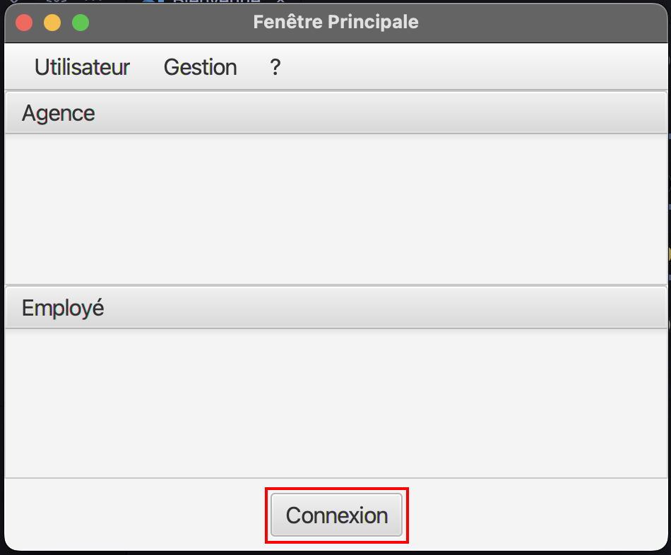
image::RessourcesAdoc/img/Connexion.png[Alt Page de connexion, 50%]

=== Connecté en tant que chef d'agence
Comme vous pouvez le contaster sur l'image ci-dessous, une fois connecté en tant que chef d'agence vous avez accès à un menu déroulant "Gestion" tout comme le guichetier qui vous permet d'accéder à la gestion des clients et des employés de votre agence.

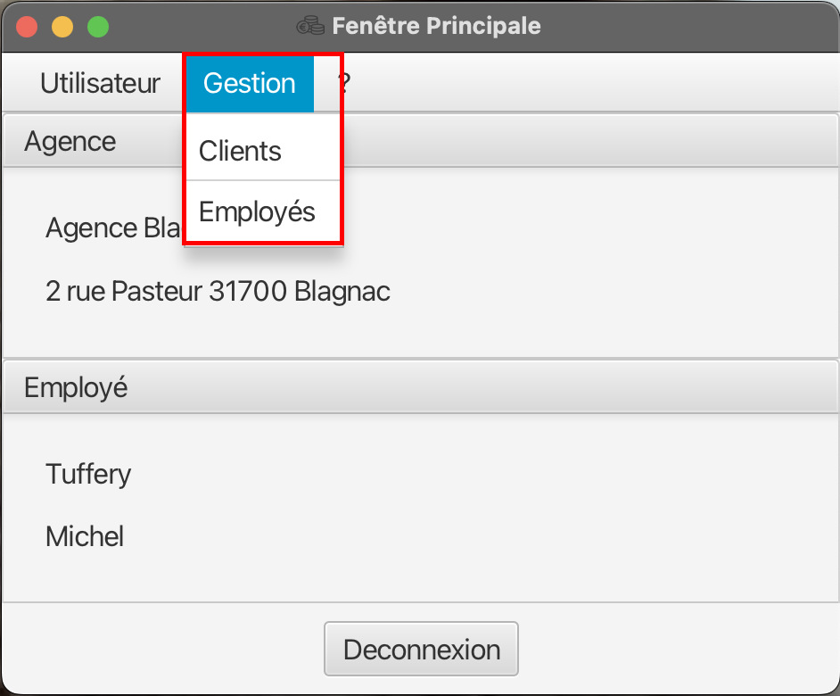

=== Connecté en tant que guichetier
Comme vous pouvez le contaster sur l'image ci-dessous, une fois connecté en tant que guichetier vous avez accès à un menu déroulant "Gestion" tout comme le chef d'agence qui vous permet d'accéder à la gestion des clients seulement.

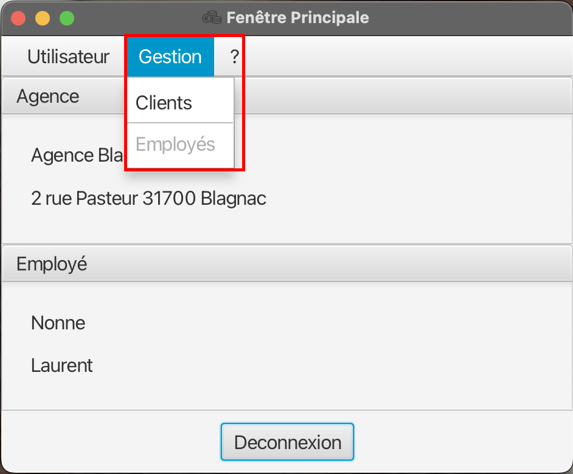

== Utilisation de l'application
=== Gestion des Employés :
``Réalisée par Enzo Fournet``

==== Accéder à la gestion des employés :
*Prérequis : Être connecté en tant que chef d'agence.*

Une fois connecter en tant que chef s'agence vous pouvez 
accéder à la gestion des employés en cliquant sur le bouton "Gestion" puis en cliquant sur "Employés".

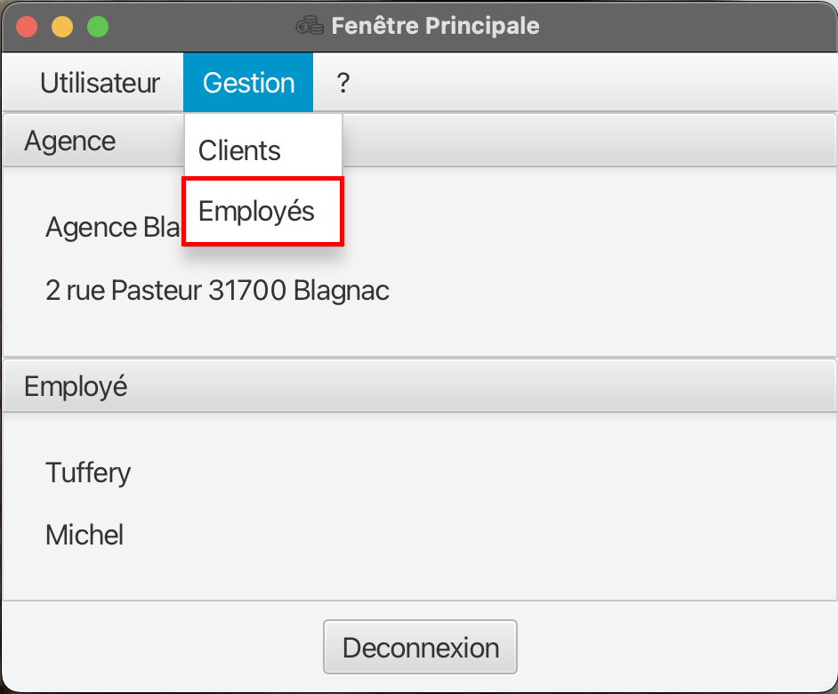

Une fois que vous avez accédé à la gestion des emplyés.

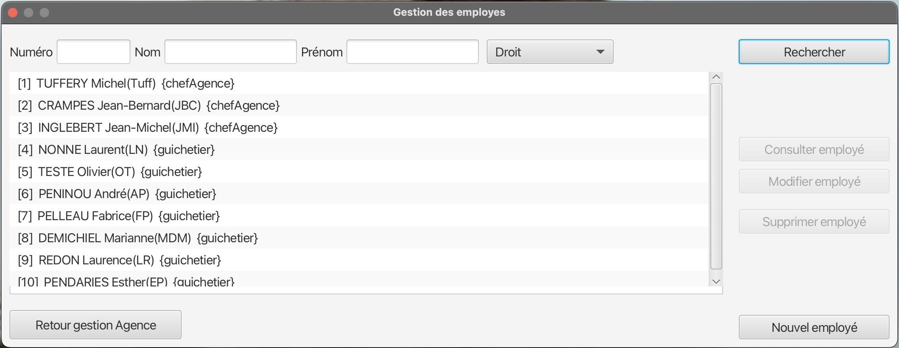

Vous pouvez voir la liste des employés de votre agence,vous avez alors la possibilité de double cliqué sur un employé pour le modifier ou le consulter en fcontion de vos droits.
Vous avez aussi la possibilité de fare un clique droit sur un employé pour faire apparaitre un menu contextuel qui vous permettra de modifier, de consulter ou de supprimer un employé en fonction de vos droits.

Les boutons lattéraux sont aussi utilisable pour modifier ou consulter un employé et seront dégrissé si vousavez pas les droits pour faire l'action demandé.

==== Consultation d'un employé :
*Prérequis : Être connecté en tant que chef d'agence et s'être rendu dans la gestion des emplyés*

Une fois que vous avez accédé à la gestion des employés.
Vous avez le droit de consulter n'importe quel employé de votre agence en double cliquant sur un employé ou en faisant un clique droit puis en cliquant sur "Consulter" ou encore en utilisant le boutons latéral.

*ATTENTION* : Si vous double cliquer sur un emploté pour lequel vous avez les droit de modification vous serez redirigé vers la page de modification de l'employé et non de consultation.

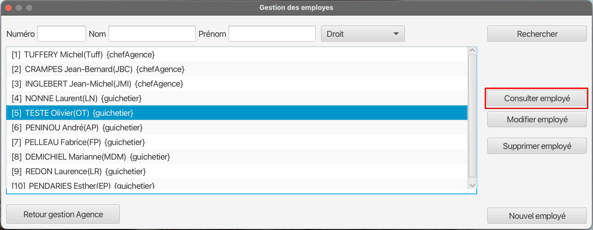

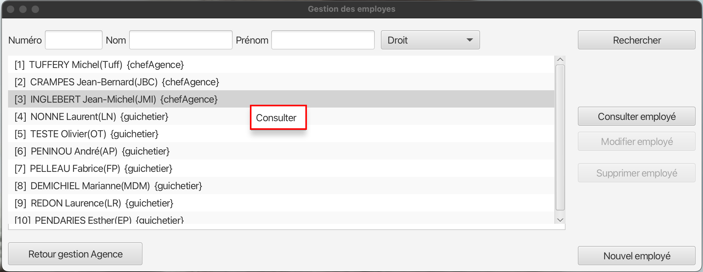

Lorsque vous aurez accédé à la page de consultation d'un employé vous aurez accès à toutes les informations de l'employé.

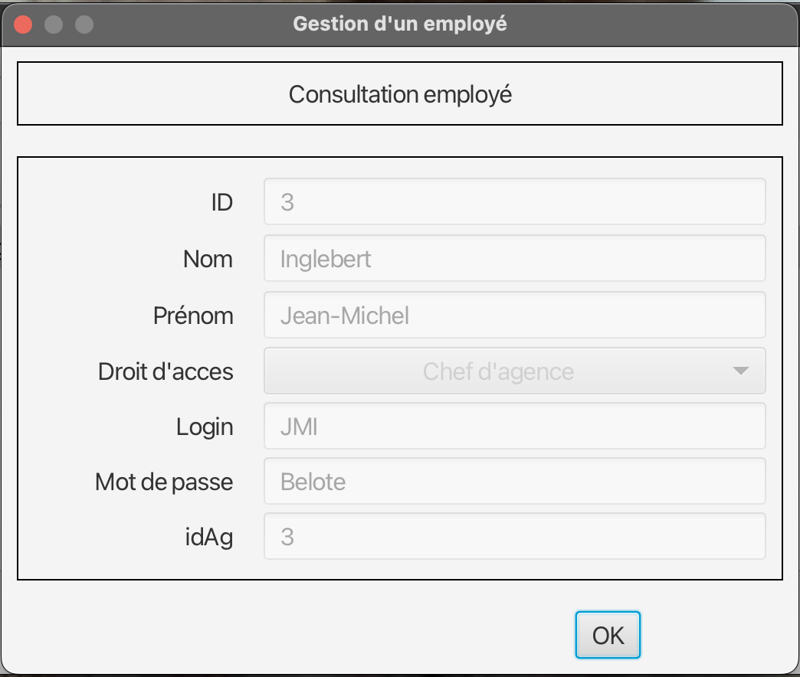

Pour revenir à la page de gestion des employés il vous suffit de cliquer sur le bouton "Ok" en bas à droite de la page.

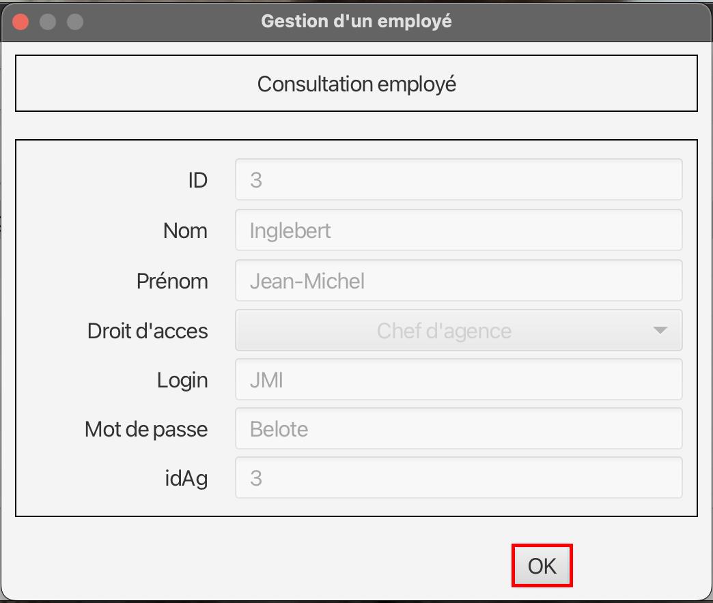

==== Création d'un nouvel employé :

*Prérequis : Être connecté en tant que chef d'agence et s'être rendu dans la gestion des emplyés*

Une fois que vous avez accédé à la gestion des employés.
Vous avez le droit de créer un nouvel employé en cliquant sur le bouton "Nouvel employé" en bas à gauche de la page.
Vous devrez alors remplir tout les champs disponnible du formulaire de création d'un employé .

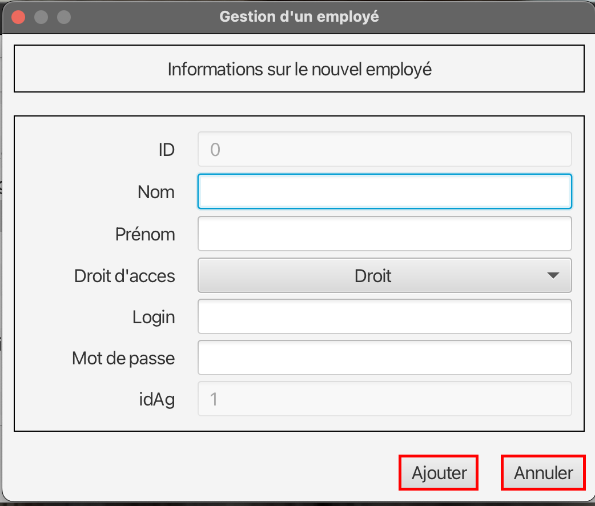

==== Modification d'un employé :

*Prérequis : Être connecté en tant que chef d'agence et s'être rendu dans la gestion des emplyés*

Une fois que vous avez accédé à la gestion des employés.
Vous avez le droit de modifier tout les guichetier de votre agence et vous même en double cliquant sur un employé que vous pouvez modifir ou en faisant un clique droit puis en cliquant sur "Modifier" ou encore en utilisant le boutons latéral lorsque vous avez les droits nécessaire.

*ATTENTION* : Si vous double cliquer sur un employé pour lequel vous n'avez les droit de modification vous serez redirigé vers la page de consulation de l'employé et non de modification.

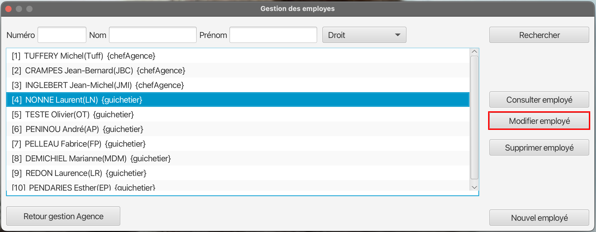

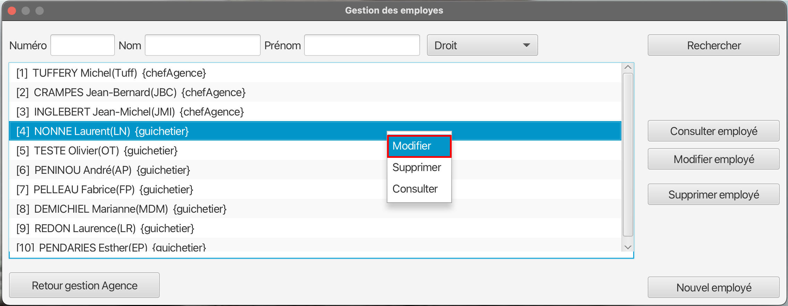

Loresque vous aurez accédé à la page de modification d'un employé vous aurez accès à toutes les informations de l'employé et vous pourrez modifier celle qui seront accéssible.

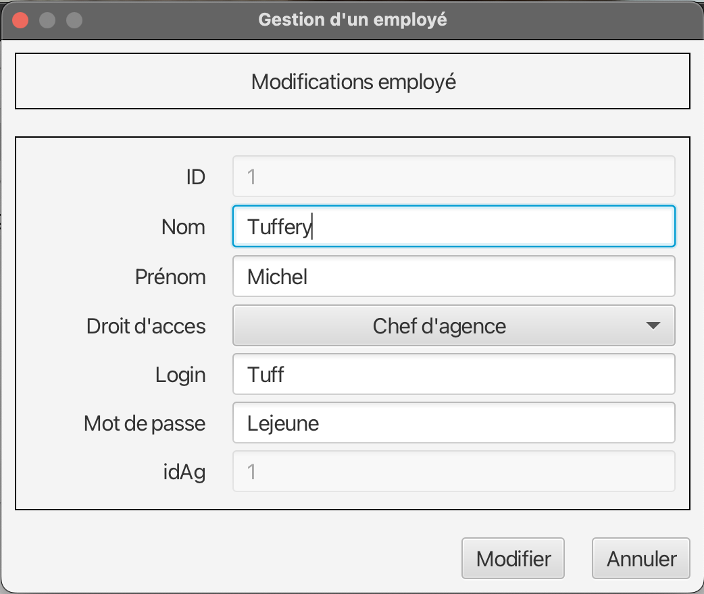

Pour Valider les modifications il vous suffit de cliquer sur le bouton "Modifier" en bas à droite de la page et pour annuler les modifications il vous suffit de cliquer sur le bouton "Annuler" en bas à droite de la page.

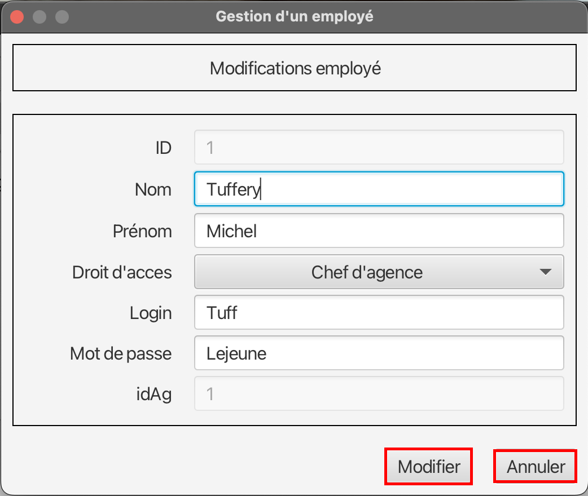

==== Suppression d'un employé :
*Prérequis : Être connecté en tant que chef d'agence et s'être rendu dans la gestion des emplyés*

Une fois que vous avez accédé à la gestion des employés.
Vous avez seulement le droit de supprimer des guichetier de votre agence en faisant un clique droit puis en cliquant sur "Supprimer" ou encore en utilisant le boutons latéral lorsque vous avez les droits nécessaire.

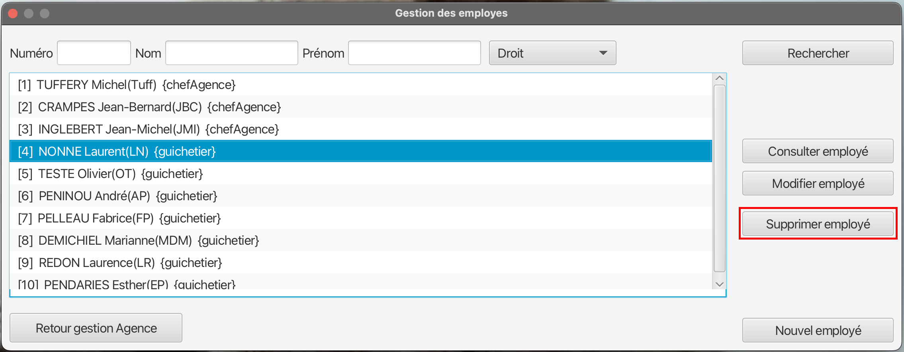

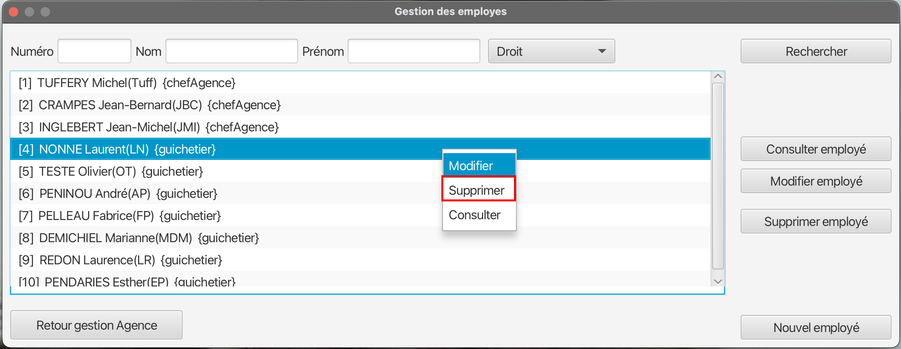

Loresque vous aurez accédé à la page de suppression d'un employé vous aurez accès à toutes les informations de l'employé et vous pourrez supprimer l'employé.

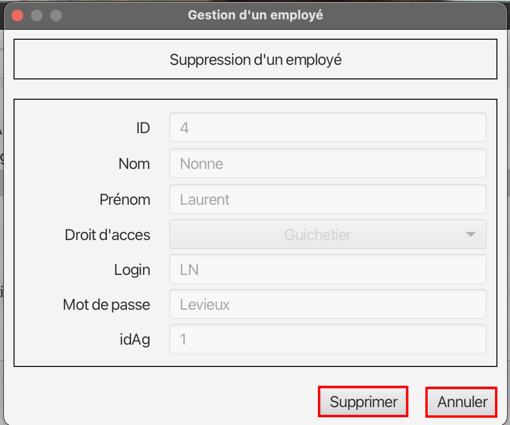

Pour Valider la suppression il vous suffit de cliquer sur le bouton "Supprimer" en bas à droite de la page et pour annuler la suppression il vous suffit de cliquer sur le bouton "Annuler" en bas à droite de la page.

=== Gestion des clients :

==== Création d'un client
``Réalisée par Julien Couderc``

*Prérequis : Être connecté en tant que guichetier ou chef d'agence et s'être rendu dans la gestion des clients*

Une fois que vous avez accédé à la gestion des clients.
Vous pouvez créer un nouveau compte en cliquant sur le bouton "Ajouter" en bas à droite de la page. Ou annuler en cliquant sur le bouton "Annuler" en bas à droite de la page.

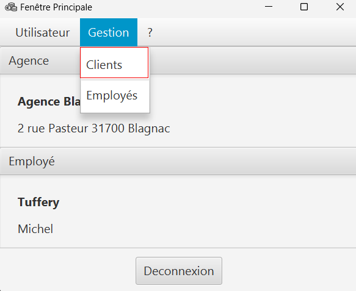

Une fois sur la page des clients vous pouvez voir la liste de tout les clients étant dans la même agence que le guichetier. Vous pouvez en cliquant sur un client activer le bouton "Modifier client", en cliquant sur ce dernier vous serez redirigé vers la page de gestion des comptes du client sélectionné.

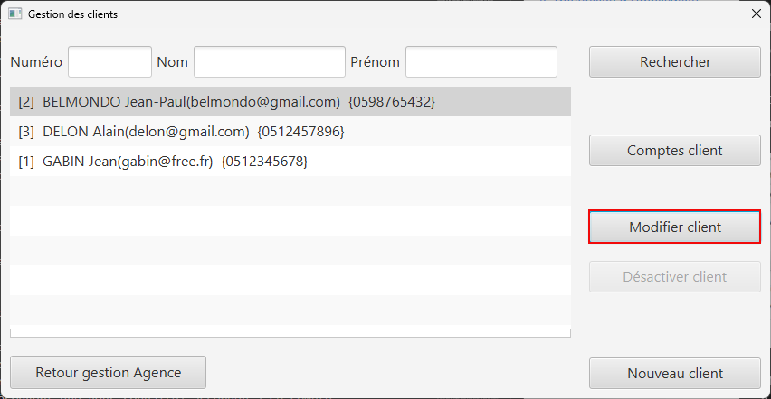

En arrivant sur cette page, il est possible de changer toutes les informations ci-dessous, ainsi, vous pouvez changer le nom, le prénom, l'adresse, le numéro de téléphone, l'e-mail et si le client est actif ou non. Puis, lorsque vous voulez confirmer ces changements, il vous suffit de cliquer sur le bouton "Modifier" et les informations seront mises à jour.

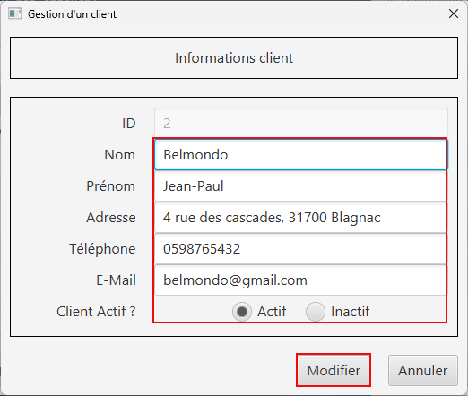

==== Recherche d'un client
``Réalisée par Julien Couderc``

Pour pouvoir rechercher un client, il faut suivre les étapes précédentes jusqu'à être dans la page des clients. Puis, vous pouvez faire une recherche d'un client en tapant son numéro, son nom ou alors son nom et prénom.

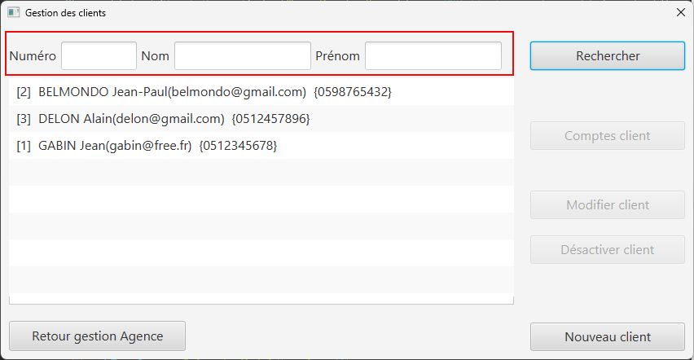

Voici la recherche par son numéro :

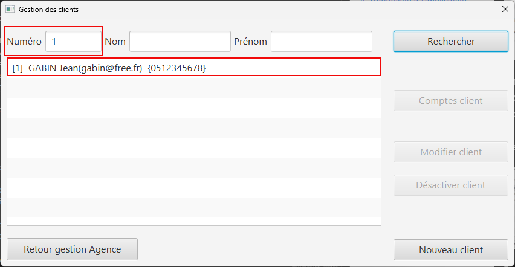

Voici la recherche par son nom :

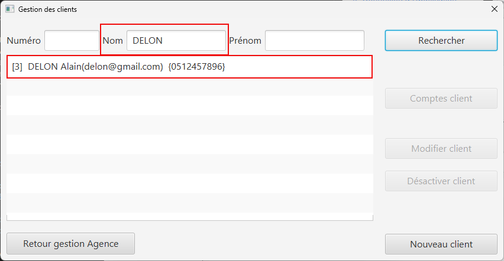

=== Gestion des comptes :

==== Création d'un compte :
``Réalisée par Yannis Gibert``

*Prérequis : Être connecté en tant que guichetier ou chef d'agence et s'être rendu dans la gestion des clients*

Une fois que vous avez accédé à la gestion des clients.
Vous pouvez créer un nouveau compte en cliquant sur le bouton "Ajouter" en bas à droite de la page. Ou annuler en cliquant sur le bouton "Annuler" en bas à droite de la page.

[horizontal]

Une fois sur la page d'accueil, il vous suffit de survoler le bouton "Gestion" avec votre souris, ce qui ouvrira un menu déroulant permettant de choisir entre Clients et Employés. Ici, ce qui nous intéresse est la section Clients, il vous suffit donc de cliquer dessus pour accéder au menu des clients.

Une fois sur la page des clients vous pouvez voir la liste de tout les clients étant dans la même agence que le guichetier. Vous pouvez en cliquant sur un client activer le bouton "Comptes client", en cliquant sur ce dernier vous serez redirigé vers la page de gestion des comptes du client sélectionné.

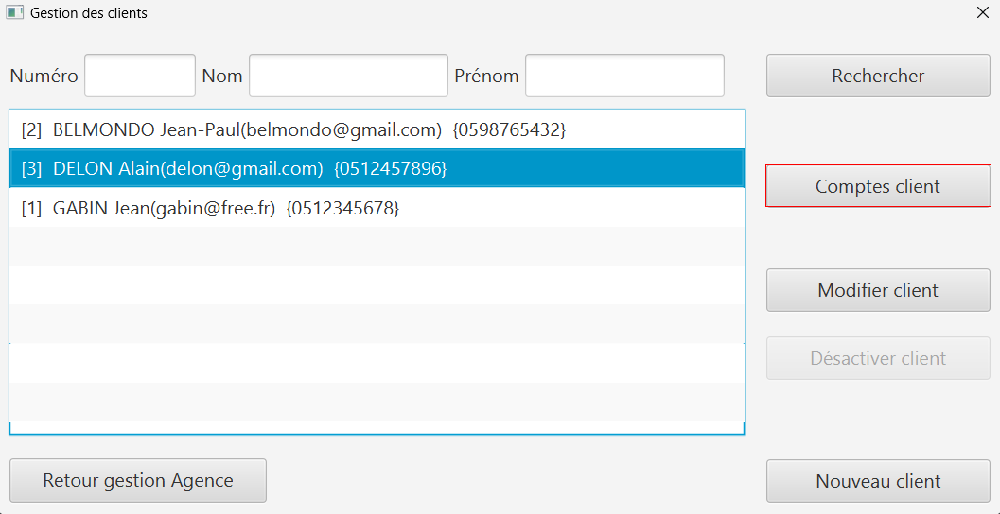

Une fois sur la page des comptes du client il vous suffit de cliquer sur "Nouveau Compte" ce qui lancera la page de création d'un nouveau compte.

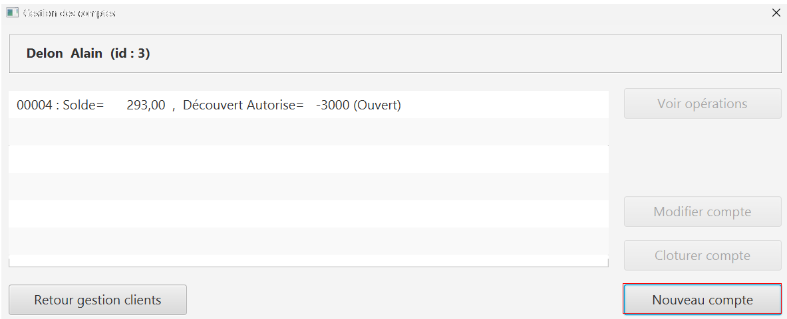

Vous voici sur la page de création du compte, les informations "Id client", "Id agence" et "Numéro compte" sont remplis automatiquement et non modifiable, en dessous vous trouverez la case "Découvert autorisé" que vous pouvez modifiez afin de saisir le découvert que vous souhaitez accorder à ce compte. Dernièrement vous trouverez la case "Solde (premier dépot)" que vous pouvez également modifier afin d'effectuer un premier dépot sur le compte du montant saisie. Une fois toutes les informations saisie vous pouvez alors cliquez sur le bouton "Ajouter" afin de valider la création du compte ou alors cliquer sur "Annuler" afin d'annuler la création du compte.

image::RessourcesAdoc/img/CréationCompte.png[Alt Page de connexion, 50%]

==== Cloturation d'un compte :
``Réalisée par Yannis Gibert``

Une fois sur la page d'acceuil il vous suffit de passer la souris sur le bouton "Gestion" ce qui ouvre un menu déroulant permettant de sélectionner entre Clients et Employés. Ici ce que nous intéressera est la partie Clients, il suffit donc de cliquer dessus afin d'accéder au menu des clients.

Une fois sur la page des clients vous pouvez voir la liste de tout les clients étant dans la même agence que le guichetier. Vous pouvez en cliquant sur un client activer le bouton "Comptes client", en cliquant sur ce dernier vous serez redirigé vers la page de gestion des comptes du client sélectionné.

Une fois sur la page des comptes du client il vous suffit de cliquer sur un compte afin de le sélectionner. Si le compte n'est pas cloturé alors le bouton "Cloturer" sera disponible, vous pouvez savoir si un compte est cloturé ou non en regardant la liste, si il est indiqué "Ouvert" cela signifie que le compte n'est pas cloturé et sinon si il est indiqué "Cloture" alors cela signifie que le compte est cloturé. En cliquant dessus la fenêtre de cloturation du compte s'ouvre.

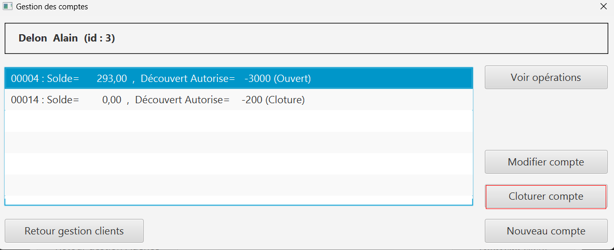

Vous voici sur la page de cloturation du compte, vous ne pouvez modifier aucune information sur cette page mais seulement les consulter afin de s'assurer qu'il s'agit bien du bon compte. Vous trouverez en bas un bouton "Supprimer", en cliquant dessus si le solde du compte est inférieur ou égal à 0 alors la page se ferme et le compte sera alors cloturé.

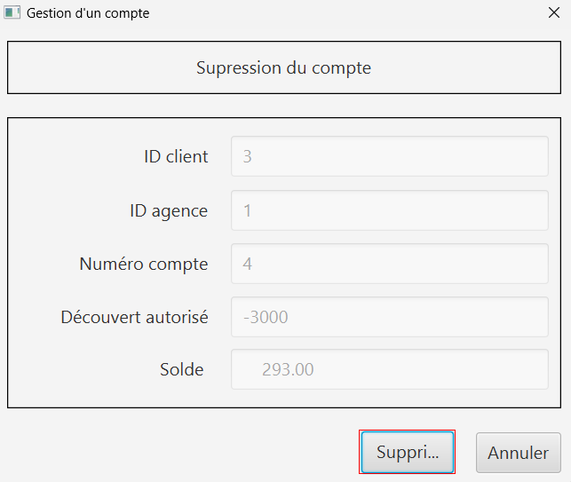

Néanmoins si le solde du compte n'est pas égal à 0 alors un message d'erreur s'affichera et empêchera la cloturation du compte, en cliquant sur "OK" vous retournez sur la page de gestion des comptes du client.

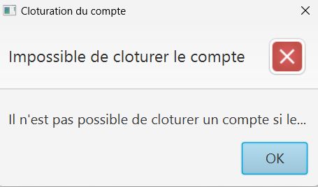

==== Modification d'un compte :
``Réalisée par Yannis Gibert``

Une fois sur la page d'accueil, il vous suffit de passer la souris sur le bouton "Gestion" ce qui ouvre un menu déroulant permettant de sélectionner entre Clients et Employés. Ici ce que nous intéressera est la partie Clients, il suffit donc de cliquer dessus afin d'accéder au menu des clients.

Une fois sur la page des clients vous pouvez voir la liste de tout les clients étant dans la même agence que le guichetier. Vous pouvez en cliquant sur un client activer le bouton "Comptes client", en cliquant sur ce dernier vous serez redirigé vers la page de gestion des comptes du client sélectionné.

Une fois sur la page des comptes du client il vous suffit de cliquer sur un compte afin de le sélectionner. Si le compte n'est pas cloturé alors le bouton "Modifier" sera disponible, vous pouvez savoir si un compte est cloturé ou non en regardant la liste, si il est indiqué "Ouvert" cela signifie que le compte n'est pas cloturé et sinon si il est indiqué "Cloture" alors cela signifie que le compte est cloturé. En cliquant dessus la fenêtre de modification du compte s'ouvre.

image::RessourcesAdoc/img/MenuCompte3.png[Alt Page de connexion, 50%]

Vous voici sur la page de modification du compte, vous ne pouvez y modifier qu'une seule information qui est le Découvert Autorisé. Une fois les modifications effectuées il vous suffit de cliquer sur "Modifier" afin de valider la modification du compte

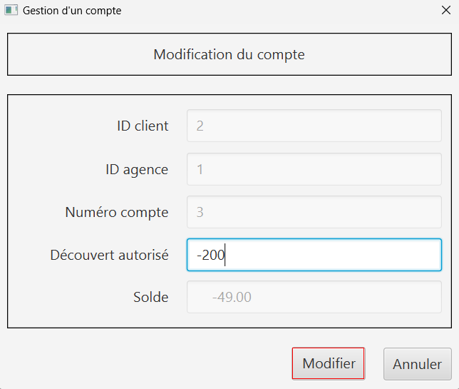

==== Débit d'un compte :
``Réalisé par Julien Couderc ``

Pour effectuer un débit, il vous suffit de vous connecter, puis passer la souris sur le bouton "Gestion" ce qui ouvre un menu déroulant permettant de sélectionner entre Clients et Employés. Ici ce que nous intéressera est la partie Clients, il suffit donc de cliquer dessus afin d'accéder au menu des clients.

Une fois sur la page des clients vous pouvez voir la liste de tout les clients étant dans la même agence que le guichetier. Vous pouvez en cliquant sur un client activer le bouton "Comptes client", en cliquant sur ce dernier vous serez redirigé vers la page de gestion des comptes du client sélectionné.

Sur cette nouvelle page, vous devez cliquer sur un compte ouvert, puis cliquer sur voir opérations de ce compte.

image::RessourcesAdoc/img/voirOperations.png[Alt Voir Opérations, 50%]

A partir de là, vous pouvez choisir l'opération que vous voulez, en ce qui nous concerne actuellement, nous allons faire un débit.

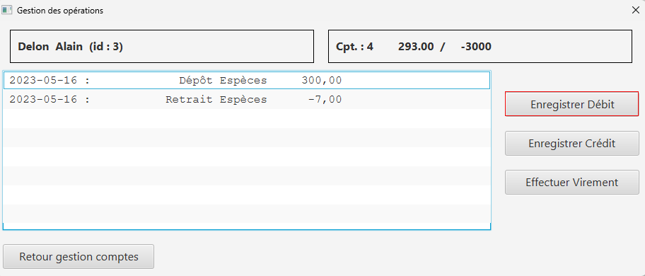

Une fois la page ouverte, vous pouvez sélectionner le type de débit que vous voulez effectuer, vous avez le choix entre "Retrait Espèces" et "Retrait Carte Bleue".

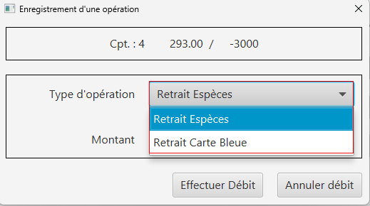

Ensuite, il vous faut entrer un montant valide, c'est à dire, que le solde du compte ne dépasse pas le dévouvert maximum autorisé et puis cliquer sur effectuer le débit.

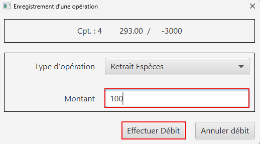

Une fois le débit effectué, l'opération est ajoutée à la liste des opérations avec le type de l'opération ainsi que le montant.

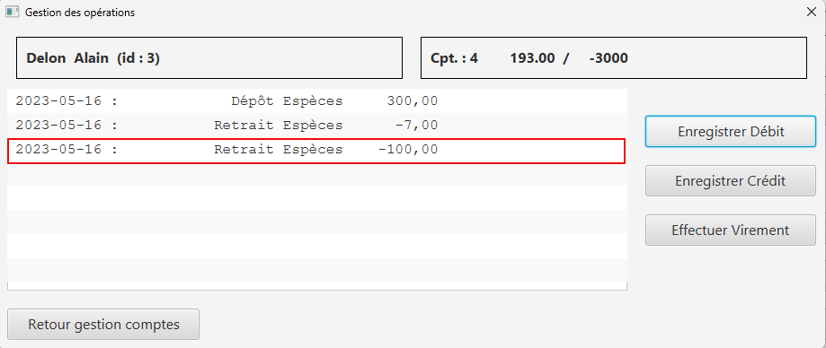

=== Crédit d'un compte :
``Réalisé par Julien Couderc ``

Pour réalisé un crédit, il suffit de répéter les étapes précédentes jusqu'à arriver à la sélection de l'opération, il vous faut cliquer sur "Enregistrer crédit".

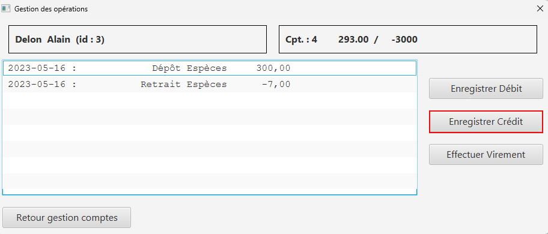

Une fois la page ouverte, vous pouvez sélectionner le type de débit que vous voulez effectuer, vous avez le choix entre "Dépôt Espèces" et "Dépôt Chèque".

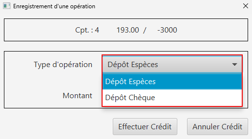

Ensuite, il vous faut entrer un montant valide, c'est à dire, que le montant ne doit pas dépasser 1 million d'euros et puis cliquer sur effectuer le crédit.

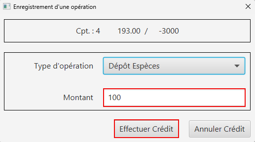

Une fois le crédit effectué, l'opération est ajoutée à la liste des opérations avec le type de l'opération ainsi que le montant.

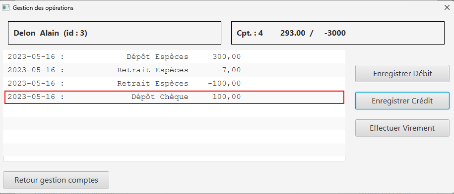

=== Virement d'un compte à un autre :
``Réalisé par Julien Couderc ``

Pour réalisé un virement, il suffit de répéter les étapes précédentes jusqu'à arriver à la sélection de l'opération, il vous faut cliquer sur "Enregistrer virement".

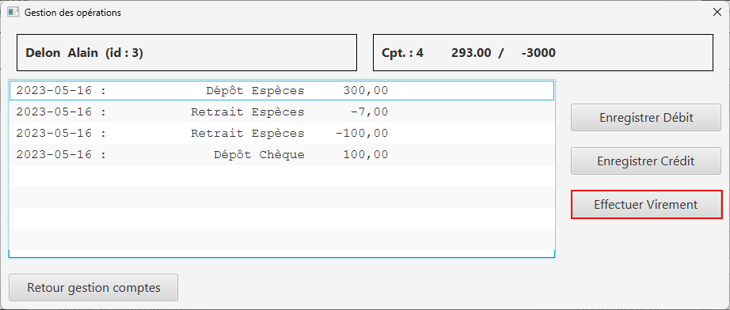

Une fois la page ouverte, vous devez entrer un numéro de compte présent dans l'agence.

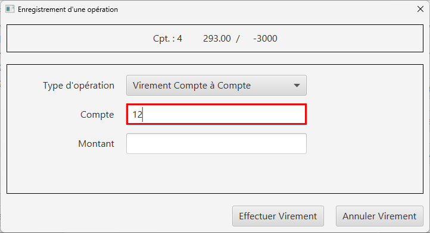

Ensuite, il vous faut entrer un montant valide, c'est à dire, que le montant ne doit pas dépasser 1 million d'euros mais aussi vous ne devez pas dépasser votre découvert maximal autorisé et puis cliquer sur effectuer le virement.

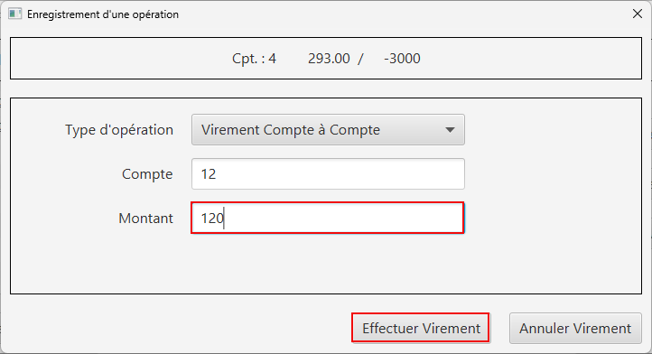

Une fois le virement effectué, l'opération est ajoutée à la liste des opérations avec le type de l'opération ainsi que le montant. Cette opération est ajoutée aux deux comptes concernés.

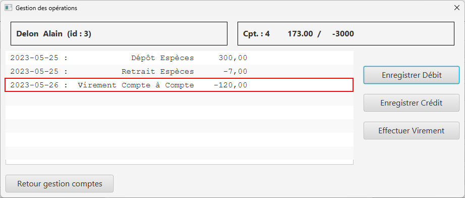

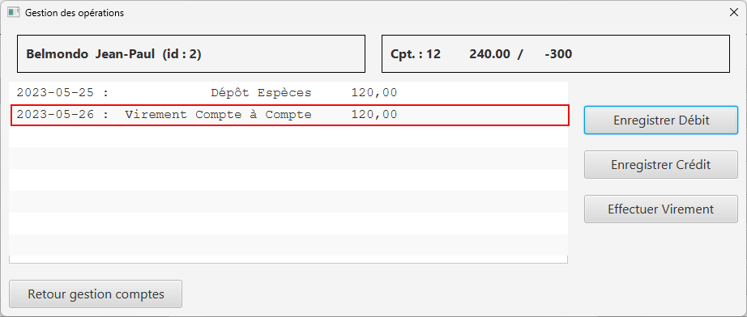

=== Simuler un emprunt avec/sans assurance
``Réalisé par Julien Couderc``
 
*Prérequis : Être connecté en tant que chef d'agence et s'être rendu dans la gestion des clients*

=== Créer un compte :
``Réalisé par Yannis Gibert``

Voici la page des comptes avant la création d'un nouveau compte : 

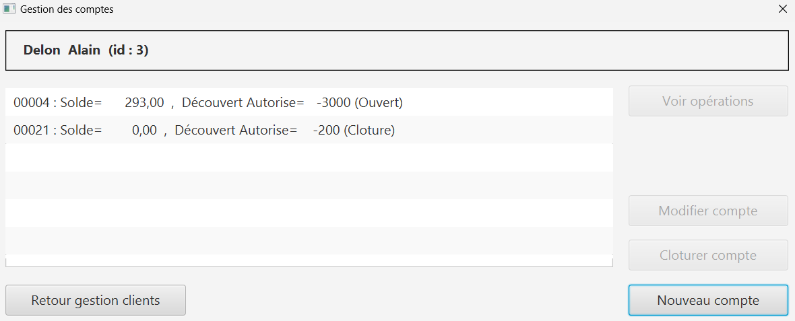

Suite à la création du compte vous pouvez voir comme ci-dessous que le nouveau compte apparait désormais dans la liste des comptes du client. 

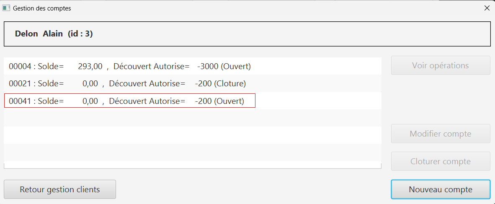

=== Modifier un compte :
``Réalisé par Yannis Gibert``

Voici la page des comptes avant la modification, on prendra comme exemple le dernier compte de la liste dont on va modifier le découvert autorisé pour le passé de -200 à -6000 : 

Suite à la modification du compte vous pouvez voir comme ci-dessous que le compte apparait toujours dans la liste des comptes du client et que son découvert autorisé est passé de -200 à -6000. 

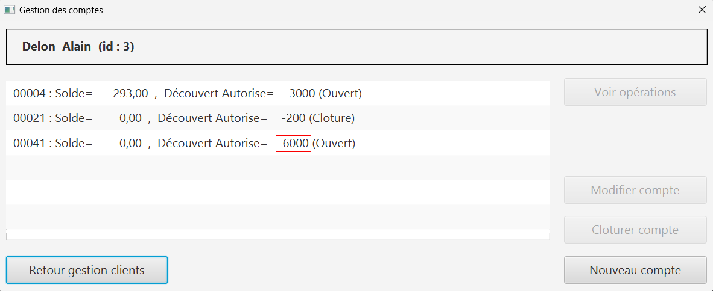

=== Clôturer un compte :
``Réalisé par Yannis Gibert``

Voici la page des comptes avant la cloturation d'un compte, nous allons cloturer le dernier compte de la liste en guise d'exemple.

Suite à la clôturation du compte vous pouvez voir comme ci-dessous que le compte apparait toujours dans la liste mais que désormais il n'est plus écrit "Ouvert" mais "Clôture" ce qui indique que le compte est bel et bien clôturé.

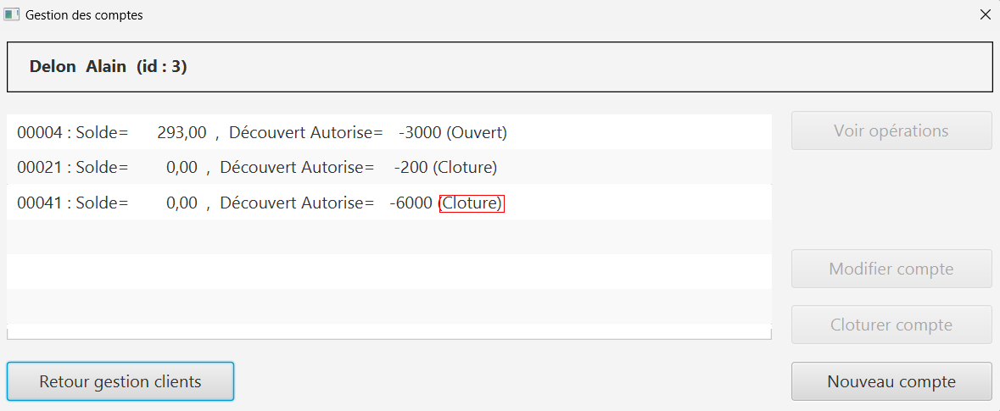

=== Générer une relevé de compte :
``Réalisé par Enzo Fournet``

*Prérequis : Être connecté en tant que guichetier ou chef d'agence et s'être rendu dans la gestion des clients*

Lorsque vous arrivé dans la age de gestion des clients il vous suffit de selectionner un client puis de cliquer sur le bouton "Comptes client"  sur la droite de la page. 

Une fois sur la page de gestion des comptes du client vous pouvez voir la liste des comptes du client et vous pouvez cliquer sur le bouton "Relevé de compte" sur la droite de la page.

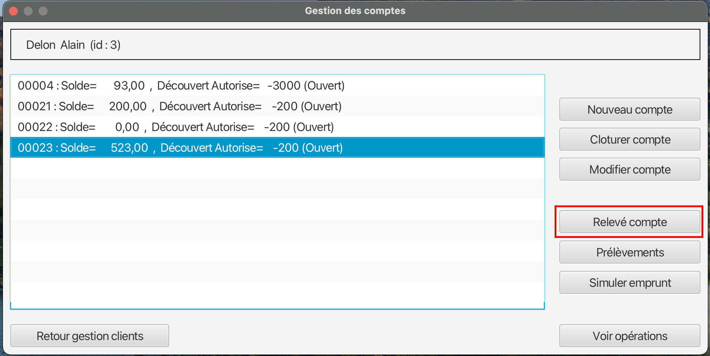

Cela ouvrira une fenêtre qui vous permettra de séléectionner l'année et le mois du relevé de compte que vous voulez générer.

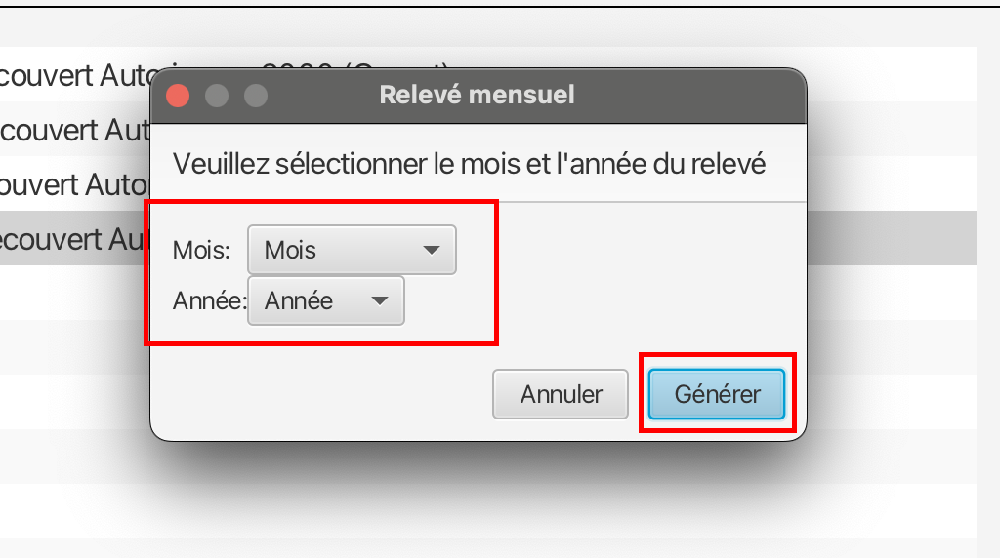

Vous serez ensuite invité à choisir un emplacement pour enregistrer le relevé de compte.

Exemple de relevé de compte :

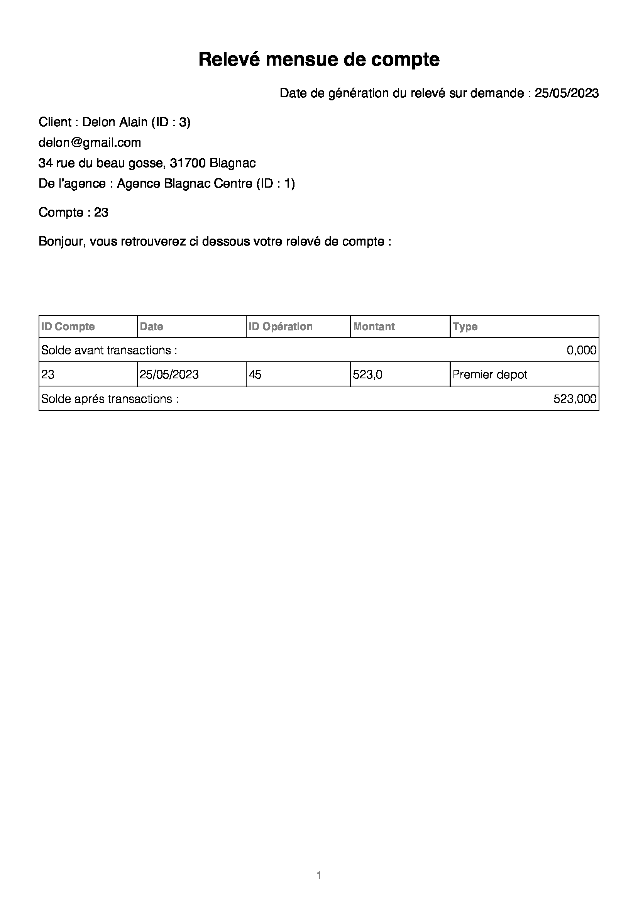

== Nous contacter

Si vous avez des questions ou si vous avez besoin d'aide, n'hésitez pas à nous contacter à l'adresse suivante: support@DailyBank.com
